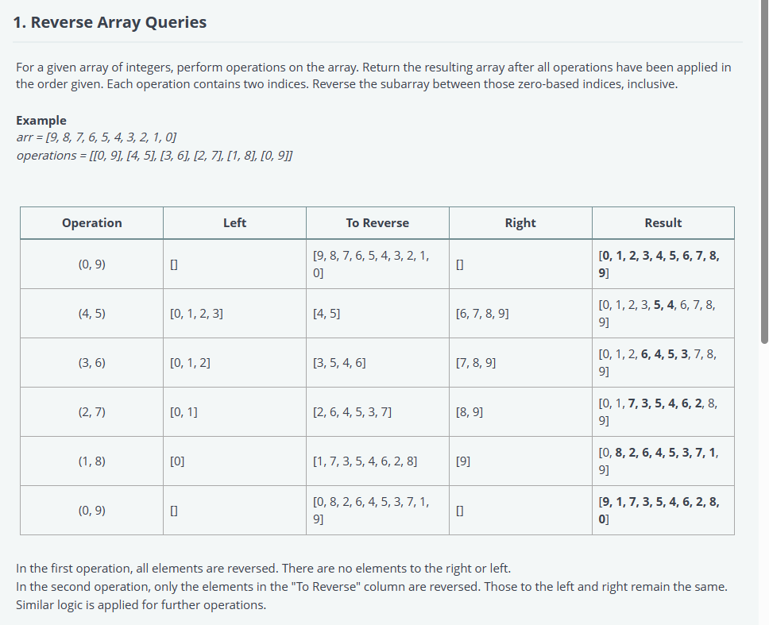
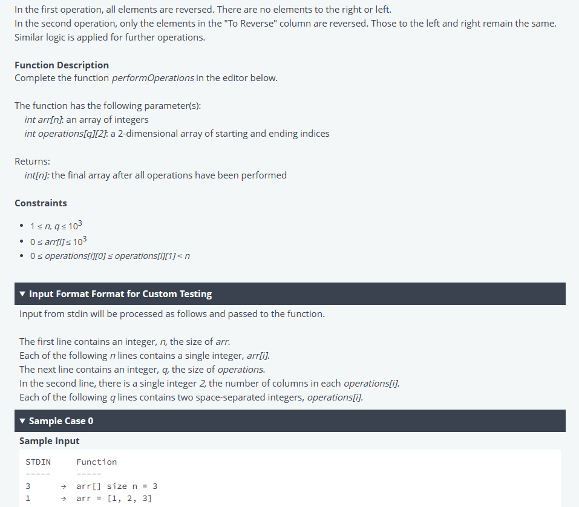
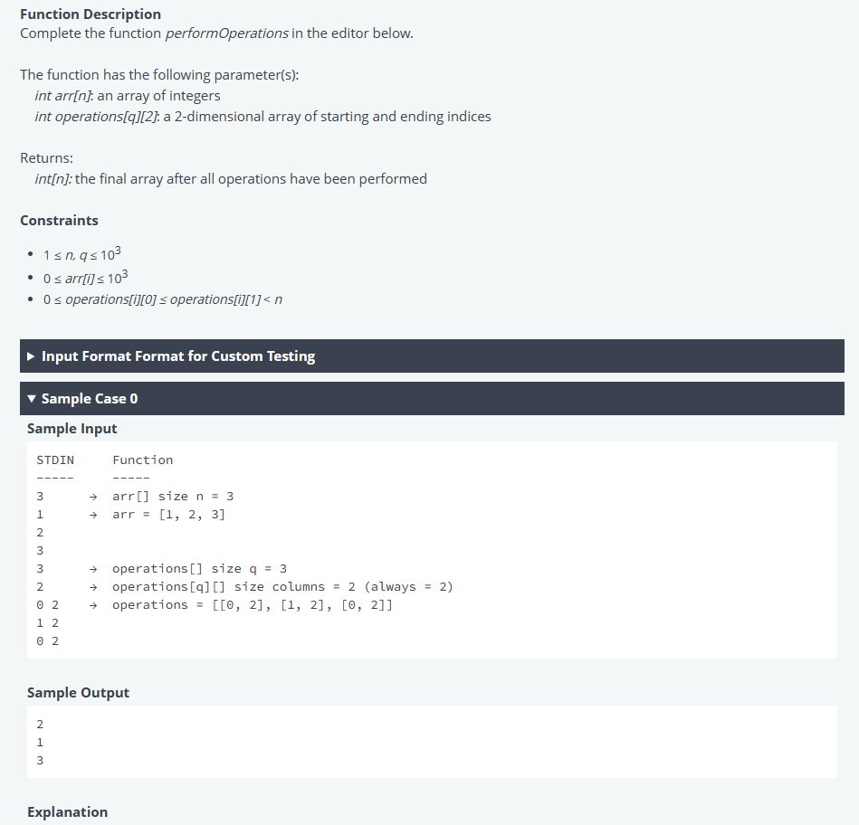
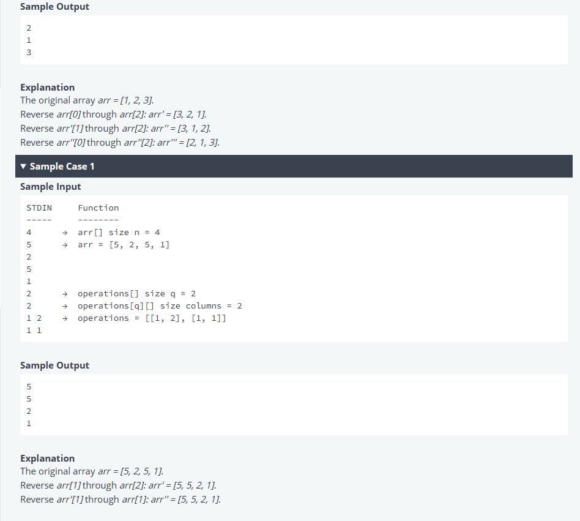

# Mavis Seeds - Engineer Hiring Test
## 1. Reverse Array Queries





Solutions with Languages:
- [Python](test-1.md#python)
- [Rust](test-1.md#rust)
- [Go](test-1.md#go)
- [Typescript](test-1.md#typescript)
- [Javascript](test-1.md#javascript)
- [Java](test-1.md#java-17)


[Test cases](test-1.md#test-cases)

#### Python:

<details><summary>Click to expand code</summary>

```python
#!/bin/python3

import math
import os
import random
import re
import sys


#
# Complete the 'performOperations' function below.
#
# The function is expected to return an INTEGER_ARRAY.
# The function accepts following parameters:
#  1. INTEGER_ARRAY arr
#  2. 2D_INTEGER_ARRAY operations
#

def performOperations(arr, operations):
    # Write your code here
if __name__ == '__main__':
    fptr = open(os.environ['OUTPUT_PATH'], 'w')

    arr_count = int(input().strip())

    arr = []

    for _ in range(arr_count):
        arr_item = int(input().strip())
        arr.append(arr_item)

    operations_rows = int(input().strip())
    operations_columns = int(input().strip())

    operations = []

    for _ in range(operations_rows):
        operations.append(list(map(int, input().rstrip().split())))

    result = performOperations(arr, operations)

    fptr.write('\n'.join(map(str, result)))
    fptr.write('\n')

    fptr.close()
```
</details>

### Rust:

<details><summary>Click to expand code</summary>

```rust
use std::env;
use std::fs::File;
use std::io::{self, BufRead, Write};

/*
 * Complete the 'performOperations' function below.
 *
 * The function is expected to return an INTEGER_ARRAY.
 * The function accepts following parameters:
 *  1. INTEGER_ARRAY arr
 *  2. 2D_INTEGER_ARRAY operations
 */

fn performOperations(arr: &[i32], operations: &[Vec<i32>]) -> Vec<i32> {

}

fn main() {
    let stdin = io::stdin();
    let mut stdin_iterator = stdin.lock().lines();

    let mut fptr = File::create(env::var("OUTPUT_PATH").unwrap()).unwrap();

    let arr_count = stdin_iterator.next().unwrap().unwrap().trim().parse::<i32>().unwrap();

    let mut arr: Vec<i32> = Vec::with_capacity(arr_count as usize);

    for _ in 0..arr_count {
        let arr_item = stdin_iterator.next().unwrap().unwrap().trim().parse::<i32>().unwrap();
        arr.push(arr_item);
    }

    let operations_rows = stdin_iterator.next().unwrap().unwrap().trim().parse::<i32>().unwrap();
    let operations_columns = stdin_iterator.next().unwrap().unwrap().trim().parse::<i32>().unwrap();

    let mut operations: Vec<Vec<i32>> = Vec::with_capacity(operations_rows as usize);

    for i in 0..operations_rows as usize {
        operations.push(Vec::with_capacity(operations_columns as usize));

        operations[i] = stdin_iterator.next().unwrap().unwrap()
            .trim_end()
            .split(' ')
            .map(|s| s.to_string().parse::<i32>().unwrap())
            .collect();
    }

    let result = performOperations(&arr, &operations);

    for i in 0..result.len() {
        write!(&mut fptr, "{}", result[i]).ok();

        if i != result.len() - 1 {
            writeln!(&mut fptr).ok();
        }
    }

    writeln!(&mut fptr).ok();
}
```

</details>

### Typescript:

<details><summary>Click to expand code</summary>

```typescript
'use strict';

import { WriteStream, createWriteStream } from "fs";
process.stdin.resume();
process.stdin.setEncoding('utf-8');

let inputString: string = '';
let inputLines: string[] = [];
let currentLine: number = 0;

process.stdin.on('data', function(inputStdin: string): void {
    inputString += inputStdin;
});

process.stdin.on('end', function(): void {
    inputLines = inputString.split('\n');
    inputString = '';

    main();
});

function readLine(): string {
    return inputLines[currentLine++];
}

/*
 * Complete the 'performOperations' function below.
 *
 * The function is expected to return an INTEGER_ARRAY.
 * The function accepts following parameters:
 *  1. INTEGER_ARRAY arr
 *  2. 2D_INTEGER_ARRAY operations
 */

function performOperations(arr: number[], operations: number[][]): number[] {

}

function main() {
    const ws: WriteStream = createWriteStream(process.env['OUTPUT_PATH']);

    const arrCount: number = parseInt(readLine().trim(), 10);

    let arr: number[] = [];

    for (let i: number = 0; i < arrCount; i++) {
        const arrItem: number = parseInt(readLine().trim(), 10);

        arr.push(arrItem);
    }

    const operationsRows: number = parseInt(readLine().trim(), 10);

    const operationsColumns: number = parseInt(readLine().trim(), 10);

    let operations: number[][] = Array(operationsRows);

    for (let i: number = 0; i < operationsRows; i++) {
        operations[i] = readLine().replace(/\s+$/g, '').split(' ').map(operationsTemp => parseInt(operationsTemp, 10));
    }

    const result: number[] = performOperations(arr, operations);

    ws.write(result.join('\n') + '\n');

    ws.end();
}
```

</details>


### Go:

<details><summary>Click to expand code</summary>

```go
package main

import (
    "bufio"
    "fmt"
    "io"
    "os"
    "strconv"
    "strings"
)

/*
 * Complete the 'performOperations' function below.
 *
 * The function is expected to return an INTEGER_ARRAY.
 * The function accepts following parameters:
 *  1. INTEGER_ARRAY arr
 *  2. 2D_INTEGER_ARRAY operations
 */

func performOperations(arr []int32, operations [][]int32) []int32 {
    // Write your code here

}

func main() {
    reader := bufio.NewReaderSize(os.Stdin, 16 * 1024 * 1024)

    stdout, err := os.Create(os.Getenv("OUTPUT_PATH"))
    checkError(err)

    defer stdout.Close()

    writer := bufio.NewWriterSize(stdout, 16 * 1024 * 1024)

    arrCount, err := strconv.ParseInt(strings.TrimSpace(readLine(reader)), 10, 64)
    checkError(err)

    var arr []int32

    for i := 0; i < int(arrCount); i++ {
        arrItemTemp, err := strconv.ParseInt(strings.TrimSpace(readLine(reader)), 10, 64)
        checkError(err)
        arrItem := int32(arrItemTemp)
        arr = append(arr, arrItem)
    }

    operationsRows, err := strconv.ParseInt(strings.TrimSpace(readLine(reader)), 10, 64)
    checkError(err)

    operationsColumns, err := strconv.ParseInt(strings.TrimSpace(readLine(reader)), 10, 64)
    checkError(err)

    var operations [][]int32
    for i := 0; i < int(operationsRows); i++ {
        operationsRowTemp := strings.Split(strings.TrimRight(readLine(reader)," \t\r\n"), " ")

        var operationsRow []int32
        for _, operationsRowItem := range operationsRowTemp {
            operationsItemTemp, err := strconv.ParseInt(operationsRowItem, 10, 64)
            checkError(err)
            operationsItem := int32(operationsItemTemp)
            operationsRow = append(operationsRow, operationsItem)
        }

        if len(operationsRow) != int(operationsColumns) {
            panic("Bad input")
        }

        operations = append(operations, operationsRow)
    }

    result := performOperations(arr, operations)

    for i, resultItem := range result {
        fmt.Fprintf(writer, "%d", resultItem)

        if i != len(result) - 1 {
            fmt.Fprintf(writer, "\n")
        }
    }

    fmt.Fprintf(writer, "\n")

    writer.Flush()
}

func readLine(reader *bufio.Reader) string {
    str, _, err := reader.ReadLine()
    if err == io.EOF {
        return ""
    }

    return strings.TrimRight(string(str), "\r\n")
}

func checkError(err error) {
    if err != nil {
        panic(err)
    }
}
```

</details>

### Java 17:
<details><summary>Click to expand code</summary>

```java
import java.io.*;
import java.math.*;
import java.security.*;
import java.text.*;
import java.util.*;
import java.util.concurrent.*;
import java.util.function.*;
import java.util.regex.*;
import java.util.stream.*;
import static java.util.stream.Collectors.joining;
import static java.util.stream.Collectors.toList;

class Result {

    /*
     * Complete the 'performOperations' function below.
     *
     * The function is expected to return an INTEGER_ARRAY.
     * The function accepts following parameters:
     *  1. INTEGER_ARRAY arr
     *  2. 2D_INTEGER_ARRAY operations
     */

    public static List<Integer> performOperations(List<Integer> arr, List<List<Integer>> operations) {
    // Write your code here

    }
}

public class Solution {
    public static void main(String[] args) throws IOException {
        BufferedReader bufferedReader = new BufferedReader(new InputStreamReader(System.in));
        BufferedWriter bufferedWriter = new BufferedWriter(new FileWriter(System.getenv("OUTPUT_PATH")));

        int arrCount = Integer.parseInt(bufferedReader.readLine().trim());

        List<Integer> arr = IntStream.range(0, arrCount).mapToObj(i -> {
            try {
                return bufferedReader.readLine().replaceAll("\\s+$", "");
            } catch (IOException ex) {
                throw new RuntimeException(ex);
            }
        })
            .map(String::trim)
            .map(Integer::parseInt)
            .collect(toList());

        int operationsRows = Integer.parseInt(bufferedReader.readLine().trim());
        int operationsColumns = Integer.parseInt(bufferedReader.readLine().trim());

        List<List<Integer>> operations = new ArrayList<>();

        IntStream.range(0, operationsRows).forEach(i -> {
            try {
                operations.add(
                    Stream.of(bufferedReader.readLine().replaceAll("\\s+$", "").split(" "))
                        .map(Integer::parseInt)
                        .collect(toList())
                );
            } catch (IOException ex) {
                throw new RuntimeException(ex);
            }
        });

        List<Integer> result = Result.performOperations(arr, operations);

        bufferedWriter.write(
            result.stream()
                .map(Object::toString)
                .collect(joining("\n"))
            + "\n"
        );

        bufferedReader.close();
        bufferedWriter.close();
    }
}
```

</details>

### Javascript
<details><summary>Click to expand code</summary>

```js
'use strict';

const fs = require('fs');

process.stdin.resume();
process.stdin.setEncoding('utf-8');

let inputString = '';
let currentLine = 0;

process.stdin.on('data', function(inputStdin) {
    inputString += inputStdin;
});

process.stdin.on('end', function() {
    inputString = inputString.split('\n');

    main();
});

function readLine() {
    return inputString[currentLine++];
}

/*
 * Complete the 'performOperations' function below.
 *
 * The function is expected to return an INTEGER_ARRAY.
 * The function accepts following parameters:
 *  1. INTEGER_ARRAY arr
 *  2. 2D_INTEGER_ARRAY operations
 */

function performOperations(arr, operations) {
    // Write your code here

}

function main() {
    const ws = fs.createWriteStream(process.env.OUTPUT_PATH);

    const arrCount = parseInt(readLine().trim(), 10);

    let arr = [];

    for (let i = 0; i < arrCount; i++) {
        const arrItem = parseInt(readLine().trim(), 10);
        arr.push(arrItem);
    }

    const operationsRows = parseInt(readLine().trim(), 10);

    const operationsColumns = parseInt(readLine().trim(), 10);

    let operations = Array(operationsRows);

    for (let i = 0; i < operationsRows; i++) {
        operations[i] = readLine().replace(/\s+$/g, '').split(' ').map(operationsTemp => parseInt(operationsTemp, 10));
    }

    const result = performOperations(arr, operations);

    ws.write(result.join('\n') + '\n');

    ws.end();
}
```

</details>


## Test cases
<details><summary>Click to expand code</summary>

- Test case 0
    - [Input](../assets/1/input000.txt)
    - [Output](../assets/1/output000.txt)
- Test case 1
    - [Input](../assets/1/input001.txt)
    - [Output](../assets/1/output001.txt)
- Test case 2
    - [Input](../assets/1/input002.txt)
    - [Output](../assets/1/output002.txt)
- Test case out    - [Input](../assets/1/input003.txt)
    - [Output](../assets/1/output003.txt)
- Test case 7
    - [Input](../assets/1/input007.txt)
    - [Output](../assets/1/output007.txt)

```cmd
Test case 3:
Expected Output
87
422
30
737
224
677
893
640
26
276
Debug output
arr:  [640, 26, 276, 224, 737, 677, 893, 87, 422, 30]
operations:  [[0, 9], [2, 2], [5, 5], [1, 6], [5, 6], [5, 9], [0, 8], [6, 7], [1, 9], [3, 3]]
======================================================================================================

Test case 4 hidden:
Debug output
arr:  [97, 848, 604, 808, 730, 537, 974, 379, 553, 830]
operations:  [[0, 9], [6, 6], [8, 9], [7, 7], [2, 4], [0, 2], [1, 3], [6, 7], [3, 4], [2, 9]]
======================================================================================================

Test case 5 hidden:
Debug output
arr:  [649, 610, 172, 730, 164, 380, 990, 640, 557, 685]
operations:  [[0, 9], [8, 8], [7, 7], [0, 3], [2, 3], [9, 9], [3, 7], [3, 9], [4, 5], [2, 6]]
======================================================================================================

Test case 6 hidden:
Debug output
arr:  [263, 585, 898, 400, 220, 998, 510, 91, 48, 110]
operations:  [[0, 9], [6, 6], [7, 8], [0, 3], [9, 9], [9, 9], [0, 7], [6, 8], [2, 7], [1, 4]]
======================================================================================================

Test case 8 hidden:
Debug output
arr:  [398, 327, 277, 459, 874, 787, 624, 523, 420, 415, 149, 588, 759, 940, 925, 563, 101, 287, 536, 344, 411, 384, 486, 609, 38, 276, 144, 609, 694, 39, 890, 332, 238, 746, 921, 898, 21, 818, 304, 281, 492, 697, 99, 869, 135, 975, 444, 826, 270, 417, 646, 188, 212, 824, 741, 760, 868, 822, 516, 159, 312, 507, 136, 852, 880, 29, 193, 833, 837, 250, 457, 919, 705, 274, 824, 506, 636, 124, 31, 373, 595, 178, 871, 587, 350, 164, 895, 749, 689, 286, 387, 163, 573, 965, 858, 648, 678, 270, 410, 21, 781, 768, 9, 912, 648, 602, 9, 253, 806, 306, 968, 643, 424, 377, 349, 252, 467, 678, 825, 398, 103, 512, 663, 844, 375, 648, 610, 299, 109, 64, 989, 641, 862, 262, 712, 893, 299, 150, 766, 900, 806, 803, 601, 661, 681, 722, 656, 998, 260, 419, 389, 36, 709, 573, 190, 727, 223, 535, 785, 907, 672, 508, 846, 841, 877, 182, 98, 128, 259, 809, 763, 184, 680, 336, 90, 356, 745, 308, 789, 332, 261, 295, 852, 471, 867, 584, 945, 72, 890, 501, 868, 382, 299, 55, 855, 138, 201, 410, 570, 907, 458, 317, 716, 779, 488, 632, 177, 635, 5, 274, 762, 169, 765, 490, 764, 89, 615, 634, 404, 966, 384, 38, 200, 374, 15, 323, 834, 191, 677, 627, 249, 694, 345, 129, 384, 589, 168, 824, 299, 291, 728, 597, 338, 888, 996, 343, 902, 360, 189, 949, 919, 404, 229, 728, 132, 735, 590, 169, 367, 651, 38, 877, 256, 535, 49, 995, 662, 654, 20, 690, 417, 381, 548, 475, 154, 696, 631, 302, 662, 663, 270, 606, 138, 831, 105, 719, 118, 115, 107, 199, 200, 263, 524, 202, 704, 296, 40, 497, 208, 934, 331, 3, 672, 907, 836, 670, 150, 91, 512, 724, 102, 256, 232, 989, 297, 465, 100, 175, 40, 291, 802, 313, 739, 95, 759, 46, 852, 664, 171, 358, 438, 622, 879, 93, 815, 183, 401, 963, 272, 386, 851, 800, 649, 797, 114, 697, 59, 943, 160, 417, 591, 803, 679, 182, 380, 359, 29, 685, 839, 974, 131, 921, 113, 412, 46, 262, 315, 705, 678, 768, 577, 566, 978, 670, 339, 524, 701, 96, 662, 249, 346, 677, 385, 840, 559, 988, 55, 644, 157, 849, 852, 870, 75, 492, 241, 971, 51, 223, 644, 404, 235, 460, 802, 449, 857, 448, 119, 498, 654, 103, 413, 558, 1, 91, 605, 620, 305, 509, 207, 672, 951, 364, 55, 223, 455, 561, 620, 474, 658, 716, 115, 760, 222, 342, 830, 965, 292, 522, 703, 46, 165, 141, 717, 722, 107, 611, 188, 931, 393, 458, 782, 717, 108, 415, 927, 838, 589, 773, 451, 659, 957, 135, 499, 531, 49, 936, 839, 483, 509, 922, 178, 579, 731, 129, 388, 601, 883, 505, 385, 980, 916, 763, 274, 964, 971, 453, 134, 413, 701, 749, 299, 702, 861, 712, 936, 633, 201, 625, 291, 346, 673, 982, 651, 959, 504, 695, 323, 116, 353, 481, 571, 668, 418, 748, 842, 286, 848, 809, 523, 26, 146, 671, 200, 751, 161, 287, 251, 840, 691, 296, 754, 33, 815, 103, 869, 740, 865, 743, 562, 238, 785, 799, 288, 665, 927, 388, 957, 976, 313, 553, 13, 252, 621, 781, 871, 830, 912, 705, 648, 756, 547, 604, 777, 965, 295, 178, 683, 187, 174, 514, 378, 429, 557, 131, 584, 256, 331, 710, 155, 154, 323, 51, 933, 616, 662, 491, 573, 359, 785, 318, 220, 184, 69, 506, 416, 538, 92, 222, 214, 332, 361, 219, 753, 531, 997, 824, 982, 9, 669, 446, 905, 614, 622, 959, 683, 321, 916, 945, 386, 541, 283, 912, 823, 375, 803, 446, 44, 899, 193, 514, 949, 168, 957, 538, 8, 66, 671, 774, 865, 425, 104, 538, 703, 977, 776, 647, 940, 747, 154, 460, 332, 88, 55, 795, 559, 575, 228, 259, 389, 631, 434, 17, 674, 535, 642, 619, 756, 586, 701, 73, 929, 107, 787, 302, 87, 766, 438, 396, 661, 474, 534, 137, 391, 798, 546, 961, 145, 678, 915, 796, 730, 374, 950, 554, 556, 124, 6, 597, 538, 947, 305, 749, 904, 344, 413, 646, 513, 161, 221, 835, 195, 182, 800, 853, 852, 933, 995, 462, 550, 291, 68, 99, 726, 488, 331, 129, 656, 101, 620, 901, 318, 451, 617, 306, 585, 566, 365, 317, 429, 5, 247, 222, 740, 437, 841, 135, 733, 878, 463, 359, 306, 552, 176, 607, 842, 859, 141, 539, 264, 887, 77, 76, 19, 508, 32, 582, 406, 591, 907, 552, 544, 999, 473, 776, 366, 224, 773, 734, 291, 465, 511, 397, 503, 663, 848, 807, 615, 166, 515, 447, 180, 949, 660, 968, 736, 484, 359, 219, 488, 63, 370, 43, 207, 908, 362, 470, 455, 47, 981, 325, 704, 522, 830, 835, 264, 545, 174, 654, 366, 654, 836, 517, 377, 908, 517, 353, 868, 487, 483, 605, 502, 139, 166, 78, 644, 212, 187, 363, 718, 119, 231, 812, 721, 482, 479, 211, 162, 834, 23, 44, 574, 162, 630, 40, 573, 56, 259, 181, 959, 600, 564, 19, 720, 662, 284, 86, 450, 993, 868, 171, 831, 601, 795, 821, 182, 660, 265, 725, 343, 454, 591, 230, 386, 109, 203, 860, 505, 420, 150, 97, 476, 615, 40, 784, 504, 118, 483, 131, 604, 828, 897, 775, 650, 523, 371, 44, 530, 230, 803, 790, 382, 590, 742, 762, 697, 98, 134, 478, 233, 860, 284, 877, 409, 190, 710, 790, 578, 118, 8, 655, 688, 316, 363, 155, 652, 254, 855, 424, 366, 276, 681, 755, 414, 784, 483, 371, 555, 254, 307, 345, 706, 736, 855, 660, 748, 447, 700, 162, 215, 401, 339, 551, 698, 707, 161, 965, 6, 92, 146, 926, 436, 65, 222, 81, 38, 385, 985, 614, 522, 712, 598, 946, 821, 641, 439, 202, 657, 804, 287, 34, 600, 516, 232, 170, 37, 240, 1, 158, 997, 780]

operations:  [[0, 999], [353, 353], [395, 749], [517, 872], [68, 152], [284, 878], [915, 944], [963, 973], [606, 682], [929, 969], [261, 561], [106, 170], [294, 962], [802, 991], [876, 976], [574, 869], [966, 985], [769, 943], [961, 978], [460, 776], [27, 140], [67, 658], [994, 998], [229, 472], [955, 978], [9, 833], [248, 317], [673, 941], [76, 936], [476, 661], [894, 922], [947, 983], [909, 954], [199, 788], [872, 898], [202, 401], [618, 677], [106, 928], [675, 890], [613, 908], [541, 560], [482, 803], [492, 992], [896, 986], [490, 992], [916, 939], [222, 670], [54, 810], [478, 760], [502, 698], [686, 740], [976, 992], [460, 832], [11, 219], [581, 717], [612, 712], [548, 655], [471, 795], [365, 681], [210, 763], [372, 908], [279, 408], [131, 631], [228, 305], [269, 441], [432, 648], [145, 965], [149, 834], [176, 587], [995, 999], [517, 865], [785, 849], [562, 810], [398, 813], [60, 824], [476, 806], [449, 633], [360, 718], [931, 948], [19, 137], [867, 995], [198, 659], [649, 710], [780, 858], [673, 832], [736, 970], [381, 558], [631, 684], [167, 839], [337, 755], [571, 935], [71, 221], [228, 472], [291, 480], [644, 740], [444, 923], [363, 736], [965, 979], [183, 201], [727, 907], [940, 982], [80, 233], [103, 160], [878, 944], [26, 412], [764, 783], [262, 376], [654, 960], [309, 479], [284, 732], [131, 859], [28, 672], [860, 905], [476, 986], [540, 665], [444, 983], [697, 750], [597, 851], [635, 840], [523, 828], [309, 548], [539, 909], [441, 645], [259, 483], [0, 815], [847, 899], [469, 473], [922, 995], [477, 481], [430, 596], [231, 236], [373, 631], [560, 733], [163, 779], [389, 620], [262, 573], [239, 820], [909, 982], [684, 773], [742, 950], [412, 913], [182, 418], [636, 860], [272, 725], [187, 202], [49, 557], [185, 268], [269, 791], [727, 790], [150, 569], [341, 546], [799, 999], [463, 887], [330, 895], [951, 953], [775, 791], [470, 571], [841, 970], [828, 848], [768, 825], [771, 872], [737, 745], [460, 876], [521, 991], [472, 831], [312, 534], [629, 644], [937, 969], [253, 729], [198, 909], [863, 892], [112, 674], [324, 437], [276, 362], [789, 790], [41, 792], [475, 788], [371, 427], [157, 234], [618, 973], [996, 998], [59, 665], [701, 937], [125, 328], [981, 995], [756, 952], [438, 546], [689, 800], [134, 912], [485, 710], [294, 786], [189, 340], [347, 825], [275, 877], [914, 961], [68, 212], [295, 480], [367, 367], [638, 775], [185, 200], [856, 967], [238, 787], [658, 842], [387, 708], [497, 774], [613, 737], [640, 679], [523, 554], [835, 856], [873, 898], [485, 535], [571, 929], [657, 837], [701, 777], [366, 750], [70, 935], [208, 597], [889, 897], [801, 813], [558, 972], [415, 630], [708, 948], [265, 294], [70, 352], [944, 997], [97, 751], [531, 619], [526, 643], [625, 692], [749, 853], [105, 676], [357, 651], [665, 960], [166, 316], [401, 603], [158, 998], [443, 639], [315, 994], [324, 575], [764, 865], [725, 892], [563, 656], [765, 982], [254, 971], [447, 666], [726, 995], [595, 804], [993, 995], [300, 455], [855, 858], [821, 944], [275, 676], [556, 967], [154, 185], [355, 444], [367, 735], [232, 854], [91, 454], [917, 977], [723, 942], [172, 855], [689, 868], [907, 962], [300, 811], [576, 609], [55, 783], [347, 880], [416, 922], [869, 898], [652, 861], [11, 779], [382, 570], [41, 558], [149, 576], [220, 259], [731, 836], [445, 775], [504, 614], [289, 569], [132, 203], [571, 592], [399, 450], [501, 887], [130, 247], [559, 774], [652, 720], [615, 898], [246, 300], [776, 848], [924, 930], [671, 810], [348, 557], [593, 602], [304, 991], [616, 996], [442, 523], [44, 826], [199, 498], [757, 964], [112, 160], [948, 996], [868, 976], [13, 697], [111, 511], [22, 226], [538, 632], [523, 646], [483, 860], [141, 741], [18, 590], [663, 677], [170, 405], [789, 919], [53, 673], [8, 393], [271, 892], [660, 953], [19, 869], [649, 730], [380, 985], [99, 383], [866, 937], [186, 593], [457, 960], [21, 263], [529, 686], [393, 488], [346, 576], [625, 713], [978, 989], [811, 929], [878, 986], [814, 819], [554, 678], [151, 912], [656, 686], [382, 975], [612, 854], [227, 412], [152, 975], [909, 938], [542, 636], [138, 604], [800, 972], [308, 795], [523, 587], [995, 999], [145, 942], [917, 943], [557, 977], [118, 398], [879, 966], [765, 971], [414, 654], [443, 963], [894, 992], [273, 839], [106, 271], [762, 907], [266, 682], [230, 408], [687, 799], [688, 836], [502, 803], [712, 819], [852, 924], [137, 303], [32, 772], [15, 280], [413, 848], [988, 997], [66, 931], [985, 998], [489, 655], [457, 591], [404, 428], [735, 835], [312, 732], [742, 895], [525, 940], [786, 897], [451, 905], [42, 996], [518, 708], [735, 882], [516, 821], [49, 325], [398, 581], [827, 906], [422, 776], [54, 543], [142, 854], [451, 847], [113, 803], [937, 980], [135, 492], [450, 548], [590, 882], [201, 564], [250, 768], [907, 981], [718, 752], [114, 512], [362, 696], [384, 871], [511, 975], [378, 614], [768, 979], [565, 851], [150, 888], [178, 763], [419, 598], [768, 871], [626, 669], [131, 307], [622, 717], [458, 921], [543, 545], [882, 910], [588, 783], [410, 456], [600, 697], [547, 827], [557, 922], [48, 189], [653, 665], [853, 951], [838, 886], [920, 923], [416, 520], [672, 872], [691, 874], [787, 824], [455, 770], [931, 937], [299, 557], [378, 420], [427, 742], [292, 387], [694, 777], [527, 775], [695, 881], [109, 759], [628, 995], [483, 839], [933, 999], [287, 721],
```

</details>


[Next to Test 2](test-2.md)