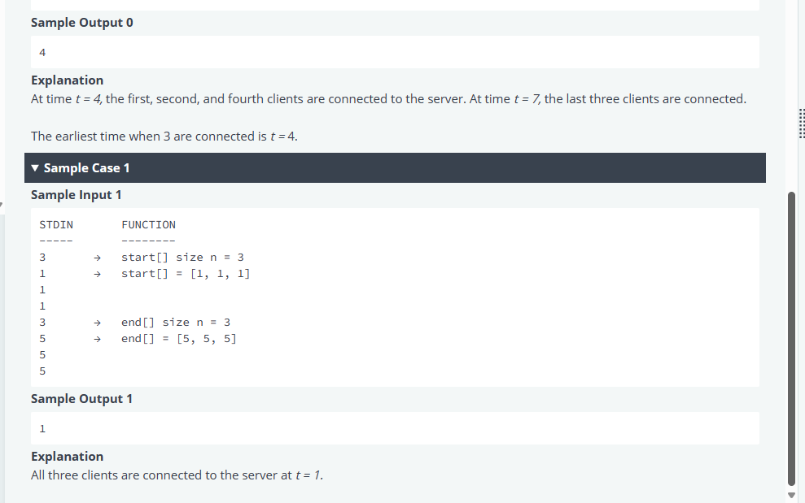

# Mavis Seeds - Engineer Hiring Test
## 2. Server Traffic Monitor




Solutions with Languages:
- [Python](test-2.md#python)
- [Rust](test-2.md#rust)
- [Go](test-2.md#go)
- [Typescript](test-2.md#typescript)
- [Javascript](test-2.md#javascript)
- [Java](test-2.md#java-17)

[Test cases](test-2.md#test-cases)

### Python:
<details><summary>Click to expand code</summary>

```python
#!/bin/python3

import math
import os
import random
import re
import sys


#
# Complete the 'getMaxTrafficTime' function below.
#
# The function is expected to return an INTEGER.
# The function accepts following parameters:
#  1. INTEGER_ARRAY start
#  2. INTEGER_ARRAY end
#

def getMaxTrafficTime(start, end):
    # Write your code here
if __name__ == '__main__':
    fptr = open(os.environ['OUTPUT_PATH'], 'w')

    start_count = int(input().strip())

    start = []

    for _ in range(start_count):
        start_item = int(input().strip())
        start.append(start_item)

    end_count = int(input().strip())

    end = []

    for _ in range(end_count):
        end_item = int(input().strip())
        end.append(end_item)

    result = getMaxTrafficTime(start, end)

    fptr.write(str(result) + '\n')

    fptr.close()

```
</details>

### Rust:

<details><summary>Click to expand code</summary>

```rust
use std::env;
use std::fs::File;
use std::io::{self, BufRead, Write};

/*
 * Complete the 'getMaxTrafficTime' function below.
 *
 * The function is expected to return an INTEGER.
 * The function accepts following parameters:
 *  1. INTEGER_ARRAY start
 *  2. INTEGER_ARRAY end
 */

fn getMaxTrafficTime(start: &[i32], end: &[i32]) -> i32 {
    // Write your code here

}

fn main() {
    let stdin = io::stdin();
    let mut stdin_iterator = stdin.lock().lines();

    let mut fptr = File::create(env::var("OUTPUT_PATH").unwrap()).unwrap();

    let start_count = stdin_iterator.next().unwrap().unwrap().trim().parse::<i32>().unwrap();

    let mut start: Vec<i32> = Vec::with_capacity(start_count as usize);

    for _ in 0..start_count {
        let start_item = stdin_iterator.next().unwrap().unwrap().trim().parse::<i32>().unwrap();
        start.push(start_item);
    }

    let end_count = stdin_iterator.next().unwrap().unwrap().trim().parse::<i32>().unwrap();

    let mut end: Vec<i32> = Vec::with_capacity(end_count as usize);

    for _ in 0..end_count {
        let end_item = stdin_iterator.next().unwrap().unwrap().trim().parse::<i32>().unwrap();
        end.push(end_item);
    }

    let result = getMaxTrafficTime(&start, &end);

    writeln!(&mut fptr, "{}", result).ok();
}
```
</details>

### Typescript:

<details><summary>Click to expand code</summary>

```typescript
'use strict';

import { WriteStream, createWriteStream } from "fs";
process.stdin.resume();
process.stdin.setEncoding('utf-8');

let inputString: string = '';
let inputLines: string[] = [];
let currentLine: number = 0;

process.stdin.on('data', function(inputStdin: string): void {
    inputString += inputStdin;
});

process.stdin.on('end', function(): void {
    inputLines = inputString.split('\n');
    inputString = '';

    main();
});

function readLine(): string {
    return inputLines[currentLine++];
}

/*
 * Complete the 'getMaxTrafficTime' function below.
 *
 * The function is expected to return an INTEGER.
 * The function accepts following parameters:
 *  1. INTEGER_ARRAY start
 *  2. INTEGER_ARRAY end
 */

function getMaxTrafficTime(start: number[], end: number[]): number {
    // Write your code here

}

function main() {
    const ws: WriteStream = createWriteStream(process.env['OUTPUT_PATH']);

    const startCount: number = parseInt(readLine().trim(), 10);

    let start: number[] = [];

    for (let i: number = 0; i < startCount; i++) {
        const startItem: number = parseInt(readLine().trim(), 10);

        start.push(startItem);
    }

    const endCount: number = parseInt(readLine().trim(), 10);

    let end: number[] = [];

    for (let i: number = 0; i < endCount; i++) {
        const endItem: number = parseInt(readLine().trim(), 10);

        end.push(endItem);
    }

    const result: number = getMaxTrafficTime(start, end);

    ws.write(result + '\n');

    ws.end();
}
```
</details>

### Go:
<details><summary>Click to expand code</summary>

```go
package main

import (
    "bufio"
    "fmt"
    "io"
    "os"
    "strconv"
    "strings"
)

/*
 * Complete the 'getMaxTrafficTime' function below.
 *
 * The function is expected to return an INTEGER.
 * The function accepts following parameters:
 *  1. INTEGER_ARRAY start
 *  2. INTEGER_ARRAY end
 */

func getMaxTrafficTime(start []int32, end []int32) int32 {
    // Write your code here

}

func main() {
    reader := bufio.NewReaderSize(os.Stdin, 16 * 1024 * 1024)

    stdout, err := os.Create(os.Getenv("OUTPUT_PATH"))
    checkError(err)

    defer stdout.Close()

    writer := bufio.NewWriterSize(stdout, 16 * 1024 * 1024)

    startCount, err := strconv.ParseInt(strings.TrimSpace(readLine(reader)), 10, 64)
    checkError(err)

    var start []int32

    for i := 0; i < int(startCount); i++ {
        startItemTemp, err := strconv.ParseInt(strings.TrimSpace(readLine(reader)), 10, 64)
        checkError(err)
        startItem := int32(startItemTemp)
        start = append(start, startItem)
    }

    endCount, err := strconv.ParseInt(strings.TrimSpace(readLine(reader)), 10, 64)
    checkError(err)

    var end []int32

    for i := 0; i < int(endCount); i++ {
        endItemTemp, err := strconv.ParseInt(strings.TrimSpace(readLine(reader)), 10, 64)
        checkError(err)
        endItem := int32(endItemTemp)
        end = append(end, endItem)
    }

    result := getMaxTrafficTime(start, end)

    fmt.Fprintf(writer, "%d\n", result)

    writer.Flush()
}

func readLine(reader *bufio.Reader) string {
    str, _, err := reader.ReadLine()
    if err == io.EOF {
        return ""
    }

    return strings.TrimRight(string(str), "\r\n")
}

func checkError(err error) {
    if err != nil {
        panic(err)
    }
}
```
</details>

### Java 15
<details><summary>Click to expand code</summary>

```java
import java.io.*;
import java.math.*;
import java.security.*;
import java.text.*;
import java.util.*;
import java.util.concurrent.*;
import java.util.function.*;
import java.util.regex.*;
import java.util.stream.*;
import static java.util.stream.Collectors.joining;
import static java.util.stream.Collectors.toList;

class Result {

    /*
     * Complete the 'performOperations' function below.
     *
     * The function is expected to return an INTEGER_ARRAY.
     * The function accepts following parameters:
     *  1. INTEGER_ARRAY arr
     *  2. 2D_INTEGER_ARRAY operations
     */

    public static List<Integer> performOperations(List<Integer> arr, List<List<Integer>> operations) {

    }

}

public class Solution {
    public static void main(String[] args) throws IOException {
        BufferedReader bufferedReader = new BufferedReader(new InputStreamReader(System.in));
        BufferedWriter bufferedWriter = new BufferedWriter(new FileWriter(System.getenv("OUTPUT_PATH")));

        int arrCount = Integer.parseInt(bufferedReader.readLine().trim());

        List<Integer> arr = IntStream.range(0, arrCount).mapToObj(i -> {
            try {
                return bufferedReader.readLine().replaceAll("\\s+$", "");
            } catch (IOException ex) {
                throw new RuntimeException(ex);
            }
        })
            .map(String::trim)
            .map(Integer::parseInt)
            .collect(toList());

        int operationsRows = Integer.parseInt(bufferedReader.readLine().trim());
        int operationsColumns = Integer.parseInt(bufferedReader.readLine().trim());

        List<List<Integer>> operations = new ArrayList<>();

        IntStream.range(0, operationsRows).forEach(i -> {
            try {
                operations.add(
                    Stream.of(bufferedReader.readLine().replaceAll("\\s+$", "").split(" "))
                        .map(Integer::parseInt)
                        .collect(toList())
                );
            } catch (IOException ex) {
                throw new RuntimeException(ex);
            }
        });

        List<Integer> result = Result.performOperations(arr, operations);

        bufferedWriter.write(
            result.stream()
                .map(Object::toString)
                .collect(joining("\n"))
            + "\n"
        );

        bufferedReader.close();
        bufferedWriter.close();
    }
}
```
</details>

### Javascript
<details><summary>Click to expand code</summary>

```js
'use strict';

const fs = require('fs');

process.stdin.resume();
process.stdin.setEncoding('utf-8');

let inputString = '';
let currentLine = 0;

process.stdin.on('data', function(inputStdin) {
    inputString += inputStdin;
});

process.stdin.on('end', function() {
    inputString = inputString.split('\n');

    main();
});

function readLine() {
    return inputString[currentLine++];
}

/*
 * Complete the 'getMaxTrafficTime' function below.
 *
 * The function is expected to return an INTEGER.
 * The function accepts following parameters:
 *  1. INTEGER_ARRAY start
 *  2. INTEGER_ARRAY end
 */

function getMaxTrafficTime(start, end) {
    // Write your code here

}

function main() {
    const ws = fs.createWriteStream(process.env.OUTPUT_PATH);

    const startCount = parseInt(readLine().trim(), 10);

    let start = [];

    for (let i = 0; i < startCount; i++) {
        const startItem = parseInt(readLine().trim(), 10);
        start.push(startItem);
    }

    const endCount = parseInt(readLine().trim(), 10);

    let end = [];

    for (let i = 0; i < endCount; i++) {
        const endItem = parseInt(readLine().trim(), 10);
        end.push(endItem);
    }

    const result = getMaxTrafficTime(start, end);

    ws.write(result + '\n');

    ws.end();
}
```
</details>

## Test cases
<details><summary>Click to expand code</summary>

- Test case 0
    - [Input](../assets/2/input000.txt)
    - [Output](../assets/2/output000.txt)
- Test case 1
    - [Input](../assets/2/input001.txt)
    - [Output](../assets/2/output001.txt)
- Test case 2
    - [Input](../assets/2/input002.txt)
    - [Output](../assets/2/output002.txt)

```
0
Expected Output
4
Debug output
start:  [2, 3, 7, 4, 7]
end:  [4, 5, 8, 7, 10]

1
Expected Output
1
Debug output
start:  [1, 1, 1]
end:  [5, 5, 5]

2
Expected Output
58
Debug output
start:  [54, 79, 45, 44, 78, 7, 49, 58, 32, 18]
end:  [82, 81, 65, 80, 98, 61, 89, 85, 44, 53]

3-hidden
Debug output
start:  [1]
end:  [1]

4-hidden
Debug output
start:  [41, 15, 41, 54, 5, 95, 23, 31, 70, 53, 92, 76, 7, 97, 15, 97, 98, 93, 66, 63, 98, 84, 57, 50, 98, 55, 37, 34, 3, 5, 21, 59, 41, 81, 79, 78, 25, 10, 49, 63, 36, 78, 31, 33, 30, 23, 17, 37, 74, 2, 84, 42, 10, 26, 8, 90, 43, 2, 28, 84, 18, 47, 34, 66, 96, 42, 88, 86, 99, 93, 35, 86, 47, 23, 14, 93, 43, 70, 13, 47, 51, 43, 76, 96, 29, 55, 22, 7, 72, 80, 90, 41, 1, 80, 81, 1, 89, 73, 65, 8, 37, 71, 23, 4, 20, 15, 12, 90, 23, 34, 87, 90, 2, 29, 44, 72, 69, 65, 93, 94, 84, 27, 13, 40, 40, 64, 62, 60, 73, 37, 93, 31, 47, 47, 100, 97, 1, 83, 82, 76, 81, 45, 19, 56, 15, 35, 15, 93, 91, 45, 5, 82, 42, 54, 33, 87, 14, 49, 34, 50, 79, 85, 2, 38, 44, 86, 37, 72, 77, 86, 36, 46, 40, 90, 89, 47, 68, 62, 95, 83, 75, 20, 13, 71, 28, 73, 65, 85, 70, 91, 12, 32, 70, 46, 17, 43, 30, 79, 18, 28, 15, 56, 24, 42, 40, 80, 82, 6, 31, 27, 42, 56, 34, 23, 36, 25, 8, 45, 74, 66, 53, 7, 53, 22, 61, 68, 53, 39, 54, 98, 9, 30, 4, 37, 79, 26, 27, 20, 26, 2, 96, 30, 3, 6, 87, 64, 75, 61, 71, 50, 81, 24, 47, 37, 24, 95, 82, 3, 12, 88, 91, 9, 89, 55, 9, 62, 26, 44, 3, 51, 92, 79, 83, 99, 16, 12, 86, 12, 56, 17, 73, 2, 92, 55, 95, 70, 15, 48, 75, 57, 34, 62, 88, 71, 14, 18, 61, 90, 29, 4, 47, 30, 94, 48, 47, 26, 6, 97, 7, 11, 74, 59, 63, 28, 32, 15, 91, 72, 72, 5, 1, 74, 26, 32, 65, 59, 44, 51, 22, 47, 68, 95, 10, 12, 23, 28, 78, 48, 86, 14, 8, 55, 35, 34, 14, 36, 87, 42, 68, 49, 21, 61, 56, 38, 84, 25, 95, 65, 17, 33, 81, 97, 63, 100, 74, 91, 14, 96, 7, 35, 63, 3, 12, 2, 10, 62, 92, 60, 27, 23, 76, 62, 43, 66, 67, 11, 89, 19, 17, 93, 97, 12, 92, 70, 22, 44, 89, 20, 71, 92, 11, 95, 19, 17, 59, 90, 45, 29, 22, 84, 15, 34, 100, 7, 58, 84, 98, 73, 46, 66, 6, 32, 48, 50, 95, 20, 1, 100, 98, 41, 96, 35, 34, 65, 48, 52, 81, 6, 60, 24, 75, 29, 76, 65, 99, 10, 46, 75, 42, 13, 13, 72, 5, 69, 60, 71, 48, 84, 23, 34, 1, 7, 79, 30, 49, 30, 30, 9, 83, 15, 48, 75, 47, 83, 62, 66, 22, 31, 3, 89, 87, 13, 9, 3, 62, 79, 25, 90, 97, 25, 89, 69, 65, 51, 94, 61, 30, 3, 37, 35, 69, 5, 68, 91, 45, 88, 31, 9, 33, 84, 31, 85, 92, 54, 59, 39, 79, 74, 3, 91, 16, 99, 13, 74, 58, 50, 19, 94, 97, 51, 40, 15, 100, 68, 3, 33, 24, 96, 10, 22, 88, 15, 23, 26, 25, 88, 52, 47, 86, 35, 71, 4, 64, 85, 50, 100, 55, 16, 52, 24, 41, 6, 32, 56, 83, 84, 28, 9, 29, 81, 100, 10, 97, 98, 71, 100, 6, 95, 15, 58, 73, 49, 64, 87, 90, 4, 54, 41, 12, 47, 56, 51, 97, 34, 63, 43, 25, 36, 11, 55, 74, 59, 53, 48, 61, 63, 51, 26, 76, 26, 37, 21, 99, 22, 52, 65, 19, 56, 79, 58, 4, 79, 69, 11, 31, 67, 12, 70, 19, 81, 62, 29, 93, 17, 100, 53, 57, 27, 58, 41, 19, 1, 98, 40, 35, 74, 71, 9, 31, 50, 68, 94, 86, 63, 61, 58, 23, 86, 40, 11, 81, 58, 12, 50, 49, 87, 19, 36, 41, 63, 5, 23, 5, 46, 84, 1, 76, 21, 84, 78, 25, 12, 80, 39, 16, 87, 16, 97, 34, 67, 96, 84, 87, 1, 5, 87, 13, 63, 29, 2, 28, 51, 43, 73, 72, 73, 33, 2, 86, 27, 64, 84, 67, 95, 42, 27, 21, 46, 98, 37, 54, 58, 84, 28, 98, 38, 92, 71, 79, 60, 65, 90, 17, 87, 6, 42, 76, 24, 91, 65, 80, 2, 91, 76, 18, 34, 5, 95, 21, 61, 54, 88, 32, 21, 34, 51, 53, 43, 4, 10, 88, 76, 1, 35, 91, 60, 30, 32, 18, 1, 20, 44, 86, 86, 94, 70, 92, 48, 91, 86, 72, 32, 81, 14, 16, 90, 12, 55, 37, 64, 60, 97, 65, 29, 81, 100, 17, 91, 61, 76, 12, 70, 12, 32, 100, 69, 60, 51, 78, 25, 38, 91, 31, 40, 34, 81, 93, 27, 55, 11, 3, 97, 38, 41, 55, 76, 72, 22, 22, 7, 45, 58, 70, 78, 3, 66, 15, 33, 11, 42, 68, 47, 7, 84, 76, 39, 92, 95, 64, 9, 37, 47, 6, 1, 60, 72, 2, 24, 16, 19, 86, 89, 11, 97, 22, 30, 48, 39, 88, 32, 78, 55, 4, 55, 20, 31, 85, 93, 55, 18, 95, 90, 30, 2, 3, 92, 81, 4, 11, 7, 85, 20, 63, 31, 86, 75, 15, 77, 41, 73, 74, 47, 17, 99, 3, 95, 52, 42, 72, 76, 61, 32, 24, 13, 100, 86, 97, 61, 42, 53, 40, 17, 89, 68, 100, 8, 14, 9, 54, 14, 68, 5, 58, 82, 25, 42, 16, 35, 45, 41, 3, 13, 79, 62, 75, 45, 11, 96, 56, 25, 88, 98, 62, 33, 99, 73, 47, 96, 43, 25, 10, 68, 69, 30, 24, 28, 76, 20, 12, 88, 38, 58, 57, 43, 27, 47, 67, 76, 28, 77, 26, 51, 15, 70, 33, 71, 27, 23, 36, 75, 92, 36, 76, 1, 36, 20, 82, 80, 39, 17, 51, 28, 31, 98, 19, 13, 87, 41, 38, 83, 36, 79, 73, 89, 35, 15, 91, 73, 95, 18, 15, 85, 24, 56, 78, 69, 43, 32, 22, 49, 2, 54, 57, 62, 84, 42, 89, 32, 78, 71, 44, 99, 24, 60, 9, 17, 64, 44, 69, 87, 68, 66, 74, 25, 36, 7, 16, 55, 76, 19, 34, 63, 92, 76, 100, 3, 1, 96, 21, 96, 97, 12, 29, 17, 31, 53, 30, 1, 100, 68, 56, 27, 3, 100, 46, 88, 36, 65, 16, 23, 97, 50, 70, 98, 83, 69, 23, 78, 92, 20, 50, 58, 92, 59, 28, 50, 57, 56, 23, 97, 68, 97, 97, 7, 95, 63, 8, 63, 96, 79, 78, 83, 31, 82, 2, 54, 61, 86, 30, 51, 18, 12, 29, 15, 88, 3, 81, 3, 20, 58, 92, 19, 80, 98, 44, 84, 8, 55, 41, 53, 10, 78, 81, 43, 13, 10, 81, 16, 20, 60, 68, 58, 78, 41, 83, 16, 78, 4, 29, 66, 43, 21, 52, 21, 95, 68, 9, 14, 92, 56, 65, 90, 73, 61, 18, 8, 46, 20, 47, 24, 86, 82, 7, 1, 74, 89, 17, 39, 5, 40, 37, 6, 4, 16, 83, 16, 18, 31, 28, 21, 27, 43, 92, 61, 6, 74, 47, 33, 28, 64, 47, 60, 98, 52, 3, 87, 87, 85, 20, 12, 52, 91, 65, 64, 27, 54, 42, 31, 89, 36, 15, 6, 42, 4, 93, 86, 9, 82, 57, 28, 84, 45, 35, 100, 89, 7, 33, 11, 72, 63, 16, 32, 99, 80, 29, 33, 5, 34, 24, 2, 80, 37, 77, 42, 66, 30, 72, 97, 59, 5, 19, 85, 61, 86, 27, 85, 53, 64, 81, 37, 76, 52, 31, 86, 34, 10, 52, 90, 81, 91, 68, 97, 52, 39, 33, 29, 3, 97, 73, 36, 77, 47, 31, 10, 85, 51, 65, 80, 99, 52, 30, 17, 99, 96, 35, 11, 30, 80, 100, 33, 68, 1, 9, 41, 78, 48, 28, 25, 90, 98, 56, 31, 21, 95, 95, 95, 81, 54, 13, 68, 47, 11, 87, 65, 64, 33, 79, 31, 48, 27, 86, 34, 53, 82, 36, 75, 67, 25, 69, 69, 31, 26, 49, 76, 94, 28, 51, 16, 91, 63, 8, 11, 30, 94, 76, 31, 1, 36, 40, 84, 73, 78, 44, 16, 61, 56, 80, 43, 16, 73, 88, 60, 89, 99, 86, 59, 51, 87, 42, 12, 71, 90, 10, 66, 50, 100, 24, 26, 17, 68, 57, 39, 24, 13, 72, 21, 23, 13, 82, 81, 66, 78, 30, 68, 46, 89, 76, 24, 73, 37, 94, 97, 3, 6, 3, 88, 76, 32, 14, 47, 11, 55, 36, 20, 61, 74, 39, 59, 22, 24, 57, 67, 83, 43, 18, 1, 61, 52, 34, 99, 48, 5, 47, 37, 91, 31, 99, 53, 93, 21, 83, 92, 11, 84, 55, 67, 19, 86, 85, 76, 8, 59, 85, 96, 55, 84, 96, 76, 12, 69, 9, 33, 77, 7, 10, 36, 45, 98, 62, 23, 48, 56, 23, 43, 51, 30, 67, 24, 76, 34, 95, 89, 22, 83, 2, 49, 47, 43, 22, 68, 78, 39, 74, 89, 91, 12, 20, 50, 1, 68, 79, 78, 13, 53, 33, 69, 67, 23, 79, 29, 84, 21, 5, 57, 52, 45, 79, 23, 84, 64, 45, 82, 100, 31, 18, 26, 4, 93, 53, 38, 79, 55, 62, 3, 40, 98, 50, 41, 52, 89, 1, 93, 91, 49, 41, 44, 31, 77, 79, 30, 2, 93, 48, 31, 45, 50, 51, 83, 59, 21, 78, 46, 29, 54, 83, 44, 68, 12, 12, 95, 95, 74, 72, 95, 95, 28, 100, 41, 11, 64, 90, 53, 85, 99, 71, 28, 29, 75, 80, 12, 89, 52, 8, 42, 4, 63, 51, 38, 55, 35, 52, 94, 27, 56, 94, 14, 48, 62, 40, 82, 63, 24, 5, 40, 41, 26, 11, 37, 81, 2, 25, 21, 1, 77, 32, 87, 99, 100, 59, 36, 81, 3, 58, 92, 28, 53, 72, 68, 100, 99, 25, 4, 97, 15, 91, 44, 91, 41, 5, 86, 74, 19, 1, 28, 30, 42, 7, 52, 10, 83, 68, 36, 53, 16, 29, 77, 57, 83, 24, 37, 25, 31, 73, 15, 82, 25, 25, 33, 76, 38, 41, 38, 25, 53, 36, 86, 6, 84, 39, 23, 21, 17, 38, 16, 78, 82, 57, 2, 51, 91, 88, 30, 79, 91, 77, 31, 30, 41, 77, 37, 37, 41, 32, 47, 78, 91, 41, 8, 89, 98, 77, 15, 29, 80, 12, 27, 11, 56, 94, 69, 22, 86, 47, 66, 28, 58, 36, 1, 5, 76, 31, 60, 29, 14, 93, 68, 87, 82, 64, 5, 16, 93, 7, 49, 46, 84, 21, 88, 95, 6, 72, 30, 47, 69, 30, 14, 40, 36, 34, 34, 8, 32, 96, 3, 96, 6, 64, 5, 91, 4, 35, 1, 51, 62, 31, 15, 48, 29, 11, 36, 36, 68, 94, 69, 57, 13, 34, 68, 39, 2, 85, 20, 37, 76, 10, 63, 37, 99, 25, 37, 84, 3, 52, 49, 29, 37, 51, 97, 49, 98, 22, 91, 30, 97, 7, 36, 91, 80, 70, 20, 12, 68, 35, 10, 96, 5, 51, 77, 63, 55, 52, 40, 8, 88, 58, 77, 13, 52, 55, 76, 18, 10, 29, 72, 5, 84, 5, 55, 85, 73, 62, 41, 11, 30, 65, 60, 50, 86, 56, 4, 29, 81, 89, 16, 37, 12, 8, 65, 87, 5, 13, 43, 22, 84, 32, 79, 41, 28, 44, 40, 53, 78, 86, 51, 67, 1, 93, 56, 91, 72, 37, 93, 59, 94, 63, 20, 74, 8, 54, 67, 91, 39, 71, 27, 7, 63, 92, 45, 15, 86, 62, 35, 20, 92, 2, 4, 99, 44, 77, 51, 19, 40, 52, 9, 73, 45, 19, 54, 55, 47, 56, 32, 76, 30, 5, 54, 100, 85, 15, 18, 48, 75, 57, 36, 60, 97, 64, 90, 35, 51, 99, 10, 59, 59, 16, 69, 86, 52, 51, 95, 64, 10, 16, 35, 18, 61, 59, 7, 33, 21, 11, 13, 26, 44, 100, 71, 37, 58, 80, 25, 78, 66, 68, 96, 67, 92, 74, 54, 69, 56, 74, 49, 79, 49, 82, 99, 70, 80, 47, 23, 89, 57, 21, 98, 5, 46, 8, 63, 76, 89, 97, 14, 59, 81, 48, 59, 6, 90, 36, 37, 86, 90, 3, 30, 74, 41, 55, 92, 46, 74, 42, 44, 24, 65, 9, 90, 7, 31, 4, 82, 35, 57, 90, 59, 28, 2, 31, 49, 73, 66, 38, 10, 50, 60, 87, 17, 61, 26, 74, 62, 69, 30, 93, 95, 72, 77, 61, 40, 85, 86, 55, 37, 90, 91, 9, 79, 64, 94, 65, 79, 94, 38, 26, 5, 37, 89, 83, 35, 47, 82, 49, 5, 100, 83, 89, 32, 16, 92, 96, 19, 21, 79, 75, 36, 17, 95, 1, 9, 71, 100, 88, 29, 75, 76, 93, 15, 78, 22, 85, 82, 100, 82, 23, 22, 34, 96, 83, 43, 1, 77, 94, 98, 22, 40, 82, 1, 98, 71, 85, 29, 28, 4, 73, 75, 100, 40, 28, 23, 72, 25, 15, 53, 4, 25, 10, 92, 98, 30, 95, 93, 30, 48, 53, 61, 74, 84, 35, 91, 90, 37, 94, 1, 79, 12, 38, 67, 62, 33, 8, 54, 8, 8, 78, 8, 19, 26, 22, 75, 1, 5, 65, 52, 24, 96, 40, 17, 25, 59, 30, 34, 31, 81, 10, 15, 12, 23, 24, 91, 49, 11, 79, 35, 33, 3, 92, 89, 21, 49, 94, 97, 8, 34, 48, 17, 88, 29, 20, 96, 78, 46, 3, 30, 65, 21, 46, 33, 74, 38, 11, 89, 34, 68, 60, 17, 46, 75, 49, 34, 57, 46, 84, 17, 94, 47, 57, 15, 84, 48, 83, 76, 64, 46, 43, 42, 47, 87, 67, 5, 89, 60, 62, 59, 89, 29, 25, 43, 92, 4, 43, 72, 33, 3, 81, 25, 22, 90, 6, 40, 20, 94, 44, 69, 61, 31, 57, 72, 72, 24, 54, 41, 86, 63, 88, 19, 1, 28, 8, 20, 59, 25, 3, 6, 87, 93, 6, 21, 86, 56, 29, 81, 49, 30, 78, 72, 77, 70, 61, 99, 37, 17, 86, 24, 71, 100, 54, 36, 12, 55, 1, 36, 67, 19, 76, 90, 17, 24, 92, 87, 50, 63, 92, 74, 80, 97, 14, 69, 81, 95, 32, 60, 63, 20, 21, 18, 100, 25, 71, 59, 53, 20, 68, 79, 24, 21, 55, 55, 29, 26, 15, 38, 21, 95, 71, 99, 76, 10, 60, 59, 100, 4, 94, 93, 36, 94, 80, 34, 39, 34, 5, 48, 15, 4, 98, 83, 60, 95, 81, 63, 75, 4, 87, 10, 74, 27, 91, 55, 86, 7, 94, 55, 6, 31, 7, 43, 5, 29, 62, 91, 72, 70, 73, 51, 73, 26, 96, 18, 11, 69, 82, 32, 49, 7, 74, 29, 40, 94, 37, 91, 72, 88, 29, 36, 17, 6, 53, 51, 29, 15, 51, 27, 54, 100, 82, 100, 11, 73, 76, 4, 73, 79, 62, 8, 55, 46, 97, 99, 82, 59, 38, 29, 60, 100, 87, 21, 24, 95, 27, 76, 18, 15, 80, 4, 21, 44, 9, 69, 5, 45, 62, 93, 93, 17, 43, 65, 87, 54, 13, 48, 94, 19, 36, 22, 85, 70, 33, 87, 41, 55, 89, 42, 4, 3, 98, 35, 47, 71, 17, 87, 36, 85, 71, 16, 100, 94, 29, 10, 64, 85, 54, 25, 96, 15, 29, 64, 90, 80, 89, 71, 99, 70, 50, 34, 45, 13, 26, 18, 36, 5, 27, 

781 905 355 738 997 646 991 298 885 819 768 677 552 399 504 843 608 257 697 397 769 991 972 495 999 558 741 969 930 811 792 968 852 151 978 758 387 967 637 984 985 674 696 850 939 836 865 874 758 917 842 890 837 996 493 146 659 501 870 722 906 531 993 882 554 965 569 998 716 940 994 473 961 996 622 990 734 703 997 369 897 903 630 653 958 861 475 424 941 857 916 676 977 990 314 856 717 817 443 908 901 605 956 949 908 974 544 930 315 808 707 951 888 897 783 162 929 918 733 759 950 898 927 915 618 471 652 975 999 805 893 919 850 653 961 958 969 956 893 732 703 971 925 1000 782 888 700 964 809 569 778 956 815 986 947 911 806 175 641 844 891 856 963 854 507 433 457 750 831 976 434 563 513 318 709 491 989 700 487 690 730 883 511 818 709 841 957 640 470 965 772 844 992 775 938 863 553 928 942 988 826 686 837 1000 782 147 850 686 748 936 625 709 811 159 801 659 512 884 437 764 931 602 875 893 612 427 614 846 465 773 976 621 976 713 395 941 635 601 883 490 970 968 812 928 564 961 815 946 969 577 632 418 989 917 420 980 874 932 744 854 950 979 449 757 749 944 721 990 590 888 689 602 954 778 697 941 609 509 517 427 923 634 480 963 930 918 438 950 948 820 918 774 935 262 641 946 729 859 836 947 963 890 489 481 419 756 976 867 756 1000 522 998 991 620 937 713 503 871 517 290 968 993 667 301 853 845 997 381 873 633 340 829 972 719 467 505 682 893 505 526 956 712 712 986 766 673 931 977 976 531 699 921 334 421 919 845 866 980 985 414 674 970 492 987 557 886 993 879 594 129 561 965 426 938 284 991 382 777 973 169 630 973 712 681 952 553 292 634 69 988 962 661 878 938 998 746 595 794 936 870 385 897 641 912 697 992 973 940 857 806 873 818 559 663 386 582 990 936 974 906 836 770 974 606 597 412 709 889 667 919 559 898 855 792 966 371 639 157 930 231 629 736 927 907 881 918 118 979 309 721 847 551 629 678 995 898 981 153 899 943 840 975 993 814 940 643 951 740 408 815 718 877 548 897 629 616 994 103 657 360 828 696 947 333 930 932 847 858 490 920 987 474 728 975 630 320 843 928 993 837 751 869 711 958 998 243 889 845 983 581 766 809 969 151 692 912 807 513 659 914 869 829 664 372 972 996 840 461 304 358 460 822 988 943 292 311 975 896 831 746 908 282 558 481 602 908 938 903 966 922 975 952 889 815 887 398 936 474 588 777 489 995 624 968 701 630 927 984 436 769 984 842 554 982 523 914 945 535 390 779 702 846 834 661 516 566 772 865 874 775 915 359 954 541 696 757 923 859 911 905 988 482 746 828 978 577 610 664 998 810 936 488 918 654 588 938 953 936 797 986 853 991 959 420 858 733 979 704 844 618 309 956 678 349 987 997 991 602 559 533 816 980 926 936 777 581 991 888 794 945 964 571 941 470 811 494 983 604 892 624 783 855 872 669 829 966 733 513 924 854 925 1000 589 668 905 277 932 998 748 803 840 810 571 794 824 619 337 995 726 982 897 994 994 333 996 958 1000 953 962 889 962 574 470 493 900 840 543 976 526 755 905 947 887 981 489 180 971 985 425 580 970 722 865 994 440 685 794 948 910 733 189 889 760 424 813 838 687 813 885 399 961 991 890 994 490 466 583 599 673 563 995 421 772 851 483 924 944 816 907 948 996 591 512 418 777 825 897 980 969 612 468 758 784 798 350 688 730 560 623 564 595 874 555 833 901 387 995 813 292 987 557 986 764 894 867 676 658 853 695 379 973 445 906 957 342 915 517 887 79 998 862 371 487 881 694 725 888 241 931 296 372 901 554 538 721 904 854 776 954 620 976 823 704 800 774 573 790 874 990 958 972 282 699 660 251 543 991 912 563 751 532 544 536 575 994 838 432 998 915 943 849 636 935 897 729 542 272 865 748 943 969 697 789 988 909 999 722 836 628 585 863 567 53 998 786 993 907 741 267 541 978 863 932 547 981 726 871 981 568 909 916 990 889 628 684 997 987 825 915 828 762 945 643 883 976 328 818 352 887 735 464 971 94 954 644 695 952 854 531 398 344 903 725 989 947 893 780 296 691 600 322 853 867 871 988 755 707 780 969 576 363 881 445 448 854 913 980 904 398 788 903 603 661 948 281 799 823 387 918 1000 975 465 543 754 659 563 737 960 901 762 1000 762 768 843 681 997 413 814 607 669 757 941 973 1000 981 708 862 423 989 920 635 822 893 911 416 794 873 838 696 450 924 616 912 946 901 989 938 966 788 434 991 863 693 428 940 641 554 766 952 797 521 493 932 750 921 916 727 926 809 833 534 261 875 945 909 925 858 956 887 936 858 924 923 983 803 767 890 939 901 956 991 996 559 965 730 981 848 960 818 652 983 808 952 903 795 946 490 436 932 776 426 939 967 823 951 933 989 822 941 257 557 854 679 891 321 465 950 978 794 852 972 551 871 289 500 752 990 952 989 547 842 787 462 594 949 774 979 211 901 917 779 249 294 899 870 577 289 270 402 659 401 647 847 978 940 968 188 974 439 700 983 721 942 234 468 845 998 939 846 680 629 987 561 651 641 559 980 514 542 970 922 970 976 146 324 994 994 914 332 894 980 914 838 272 894 694 724 483 483 657 854 951 978 632 520 728 790 522 982 998 749 706 783 830 602 858 987 919 770 997 647 680 973 956 644 210 959 694 576 563 747 878 585 976 851 923 733 477 815 928 223 984 429 424 913 733 907 998 476 850 745 693 847 686 752 914 391 817 947 360 151 998 892 564 859 232 977 808 704 883 822 335 877 894 724 861 557 997 945 687 995 668 121 753 856 974 467 510 734 194 736 821 655 803 656 833 963 451 939 550 988 993 722 975 666 791 933 496 936 816 898 201 794 939 708 859 409 980 992 295 167 902 861 620 953 783 960 923 899 999 903 883 340 251 989 938 783 976 780 702 556 129 556 653 460 876 898 306 829 461 994 920 459 240 409 919 787 374 619 937 729 969 819 893 961 958 784 539 919 946 486 749 281 235 682 869 950 892 989 785 631 970 940 281 618 715 986 957 545 970 960 866 794 667 699 983 828 998 496 963 776 926 902 679 832 525 982 705 482 745 663 848 946 777 765 562 591 642 732 475 80 695 976 781 906 894 763 958 1000 976 974 984 733 908 973 997 990 574 747 463 727 613 957 248 978 987 859 797 916 860 445 570 979 974 980 754 714 898 758 991 831 319 796 548 675 676 953 459 909 497 888 964 71 505 496 581 952 978 816 944 979 994 860 528 1000 810 786 885 477 483 937 969 915 762 834 251 695 697 156 878 951 996 811 976 450 601 861 579 776 829 812 999 724 996 972 641 990 755 218 849 999 941 497 956 773 494 831 831 559 795 446 985 532 817 872 965 609 942 980 581 852 782 587 784 915 969 998 733 1000 319 973 819 899 897 541 798 886 498 885 730 829 885 216 978 23 788 890 401 484 911 885 689 741 952 908 423 304 791 781 434 901 981 803 842 882 977 616 520 633 814 638 714 922 568 510 522 941 590 912 811 952 895 873 576 262 914 833 795 692 525 959 780 912 745 653 781 731 582 724 435 819 716 959 996 963 697 928 977 983 239 933 680 644 494 718 749 758 926 307 725 671 683 510 972 306 729 890 720 609 886 853 364 824 938 996 724 884 673 790 535 939 917 771 883 909 992 438 956 728 817 635 816 486 632 941 903 926 840 499 963 880 906 227 821 999 840 742 750 923 412 846 802 998 293 874 704 477 920 887 705 850 635 743 649 780 143 912 736 483 937 679 867 643 498 855 976 703 228 612 850 610 991 876 755 383 441 818 899 947 955 837 392 515 287 394 809 949 990 442 994 737 684 940 965 841 773 853 899 968 959 997 789 829 737 366 942 805 850 849 843 470 120 461 327 629 136 314 919 872 370 860 777 871 951 767 516 962 562 486 960 980 597 425 825 896 288 815 592 846 995 477 451 883 955 836 327 384 860 493 497 605 809 997 983 678 703 904 951 916 581 993 180 940 901 881 977 866 711 885 649 263 968 892 369 252 731 736 946 629 777 515 833 400 403 767 957 693 655 939 864 590 795 211 781 711 37 310 764 269 837 422 583 942 799 389 815 789 762 418 522 713 792 908 240 804 601 458 944 363 774 997 873 865 959 964 900 861 998 939 851 987 880 972 847 998 445 549 841 996 937 103 849 917 877 974 499 655 716 813 852 298 890 687 761 685 564 231 987 890 904 803 853 453 897 924 888 691 847 866 917 916 912 830 651 958 917 767 973 311 851 199 677 918 619 874 604 803 440 613 951 877 776 803 881 726 777 858 952 485 969 534 454 783 891 453 919 479 1000 938 972 761 670 504 751 613 717 869 556 996 516 686 897 864 927 869 965 682 849 725 482 376 845 969 921 902 992 618 842 711 976 604 459 550 596 540 651 872 440 354 904 990 690 692 645 668 353 812 816 415 935 547 890 959 903 996 1000 513 483 989 909 894 929 848 977 843 830 885 427 700 777 969 393 996 569 991 819 933 348 501 754 914 625 889 979 904 970 944 748 723 840 880 534 917 657 982 690 702 549 872 118 681 885 939 546 916 936 883 761 428 621 961 663 627 832 868 907 823 481 979 388 586 873 986 994 868 962 924 118 909 717 767 815 691 734 979 498 682 968 572 741 968 505 613 961 970 976 896 746 669 962 715 485 692 64 855 817 867 452 659 74 200 703 597 304 851 885 886 949 568 905 811 886 740 661 752 934 460 274 561 547 802 333 227 674 997 991 963 599 858 848 764 990 954 719 433 890 511 719 866 576 585 959 951 829 914 512 784 507 974 563 635 848 787 411 763 218 208 613 772 836 863 724 415 732 421 443 902 547 919 542 815 822 258 756 377 799 678 969 441 488 806 692 716 824 865 390 794 948 848 850 980 852 973 538 805 950 823 396 947 492 862 514 449 997 806 607 958 886 815 856 989 574 571 588 765 904 360 132 304 584 776 890 799 683 798 993 892 1000 725 918 398 940 972 798 993 979 467 998 866 688 857 975 369 963 932 802 994 951 993 648 813 872 989 584 867 478 947 812 972 763 691 679 585 699 398 804 970 985 795 964 736 966 932 969 525 677 871 875 625 867 622 628 469 553 958 699 995 441 799 344 832 959 371 826 577 387 883 988 770 772 899 910 648 764 977 831 562 932 98 980 477 937 611 778 929 522 870 407 414 799 873 972 806 642 969 784 497 667 976 641 951 312 855 961 529 853 653 994 846 454 688 933 847 823 811 957 879 702 479 660 785 992 865 714 993 802 898 156 740 718 901 890 916 851 965 125 849 756 895 971 989 845 886 996 939 928 958 986 849 996 927 515 839 970 755 558 342 988 994 567 833 796 968 231 181 961 913 77 972 909 488 583 485 894 931 475 821 332 723 718 813 440 881 988 747 550 623 795 419 256 948 751 931 954 682 894 705 906 948 856 799 803 313 937 212 928 913 982 641 549 664 744 150 426 957 964 994 427 741 413 559 621 772 651 997 880 847 503 561 913 515 310 697 370 213 873 349 595 773 924 852 635 934 687 854 992 898 978 641 988 858 88 334 860 760 826 792 992 498 718 990 988 865 882 850 516 920 948 876 974 770 833 938 615 836 672 723 975 772 437 568 977 927 604 804 645 981 812 940 913 743 669 668 254 961 790 869 662 736 670 601 913 754 932 858 894 958 719 885 665 876 918 972 492 860 962 356 956 1000 599 959 825 960 629 763 189 721 297 
```
</details>

[Back to Test 1](test-1.md)

[Next to Test 3](test-3.md)