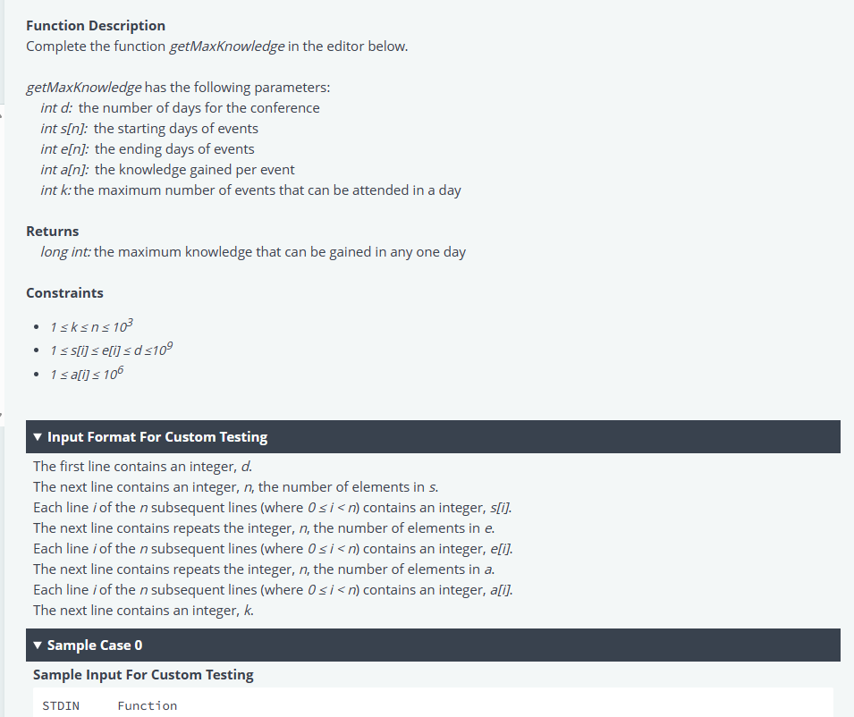

# Mavis Seeds - Engineer Hiring Test
## 3. Maximum Knowledge




Solutions with Languages:
- [Python](test-3.md#python)
- [Rust](test-3.md#rust)
- [Go](test-3.md#go)
- [Typescript](test-3.md#typescript)
- [Javascript](test-3.md#javascript)
- [Java](test-3.md#java-15)

[Test cases](test-3.md#test-cases)


### Python:
<details><summary>Click to expand code</summary>

```python
#!/bin/python3

import math
import os
import random
import re
import sys

#
# Complete the 'getMaxKnowledge' function below.
#
# The function is expected to return a LONG_INTEGER.
# The function accepts following parameters:
#  1. INTEGER d
#  2. INTEGER_ARRAY s
#  3. INTEGER_ARRAY e
#  4. INTEGER_ARRAY a
#  5. INTEGER k
#

def getMaxKnowledge(d, s, e, a, k):
    # Write your code here
if __name__ == '__main__':
    fptr = open(os.environ['OUTPUT_PATH'], 'w')

    d = int(input().strip())

    s_count = int(input().strip())

    s = []

    for _ in range(s_count):
        s_item = int(input().strip())
        s.append(s_item)

    e_count = int(input().strip())

    e = []

    for _ in range(e_count):
        e_item = int(input().strip())
        e.append(e_item)

    a_count = int(input().strip())

    a = []

    for _ in range(a_count):
        a_item = int(input().strip())
        a.append(a_item)

    k = int(input().strip())

    result = getMaxKnowledge(d, s, e, a, k)

    fptr.write(str(result) + '\n')

    fptr.close()
```
</details>

### Rust:
<details><summary>Click to expand code</summary>

```rust
use std::env;
use std::fs::File;
use std::io::{self, BufRead, Write};

/*
 * Complete the 'getMaxKnowledge' function below.
 *
 * The function is expected to return a LONG_INTEGER.
 * The function accepts following parameters:
 *  1. INTEGER d
 *  2. INTEGER_ARRAY s
 *  3. INTEGER_ARRAY e
 *  4. INTEGER_ARRAY a
 *  5. INTEGER k
 */

fn getMaxKnowledge(d: i32, s: &[i32], e: &[i32], a: &[i32], k: i32) -> i64 {

}
fn main() {
    let stdin = io::stdin();
    let mut stdin_iterator = stdin.lock().lines();

    let mut fptr = File::create(env::var("OUTPUT_PATH").unwrap()).unwrap();

    let d = stdin_iterator.next().unwrap().unwrap().trim().parse::<i32>().unwrap();

    let s_count = stdin_iterator.next().unwrap().unwrap().trim().parse::<i32>().unwrap();

    let mut s: Vec<i32> = Vec::with_capacity(s_count as usize);

    for _ in 0..s_count {
        let s_item = stdin_iterator.next().unwrap().unwrap().trim().parse::<i32>().unwrap();
        s.push(s_item);
    }

    let e_count = stdin_iterator.next().unwrap().unwrap().trim().parse::<i32>().unwrap();

    let mut e: Vec<i32> = Vec::with_capacity(e_count as usize);

    for _ in 0..e_count {
        let e_item = stdin_iterator.next().unwrap().unwrap().trim().parse::<i32>().unwrap();
        e.push(e_item);
    }

    let a_count = stdin_iterator.next().unwrap().unwrap().trim().parse::<i32>().unwrap();

    let mut a: Vec<i32> = Vec::with_capacity(a_count as usize);

    for _ in 0..a_count {
        let a_item = stdin_iterator.next().unwrap().unwrap().trim().parse::<i32>().unwrap();
        a.push(a_item);
    }

    let k = stdin_iterator.next().unwrap().unwrap().trim().parse::<i32>().unwrap();

    let result = getMaxKnowledge(d, &s, &e, &a, k);

    writeln!(&mut fptr, "{}", result).ok();
}
```
</details>

### Typescript:
<details><summary>Click to expand code</summary>

```typescript
'use strict';

import { WriteStream, createWriteStream } from "fs";
process.stdin.resume();
process.stdin.setEncoding('utf-8');

let inputString: string = '';
let inputLines: string[] = [];
let currentLine: number = 0;

process.stdin.on('data', function(inputStdin: string): void {
    inputString += inputStdin;
});

process.stdin.on('end', function(): void {
    inputLines = inputString.split('\n');
    inputString = '';

    main();
});

function readLine(): string {
    return inputLines[currentLine++];
}
/*
 * Complete the 'getMaxKnowledge' function below.
 *
 * The function is expected to return a LONG_INTEGER.
 * The function accepts following parameters:
 *  1. INTEGER d
 *  2. INTEGER_ARRAY s
 *  3. INTEGER_ARRAY e
 *  4. INTEGER_ARRAY a
 *  5. INTEGER k
 */

function getMaxKnowledge(d: number, s: number[], e: number[], a: number[], k: number): number {
    // Write your code here

}

function main() {
    const ws: WriteStream = createWriteStream(process.env['OUTPUT_PATH']);

    const d: number = parseInt(readLine().trim(), 10);

    const sCount: number = parseInt(readLine().trim(), 10);

    let s: number[] = [];

    for (let i: number = 0; i < sCount; i++) {
        const sItem: number = parseInt(readLine().trim(), 10);

        s.push(sItem);
    }

    const eCount: number = parseInt(readLine().trim(), 10);

    let e: number[] = [];

    for (let i: number = 0; i < eCount; i++) {
        const eItem: number = parseInt(readLine().trim(), 10);

        e.push(eItem);
    }

    const aCount: number = parseInt(readLine().trim(), 10);

    let a: number[] = [];

    for (let i: number = 0; i < aCount; i++) {
        const aItem: number = parseInt(readLine().trim(), 10);

        a.push(aItem);
    }

    const k: number = parseInt(readLine().trim(), 10);

    const result: number = getMaxKnowledge(d, s, e, a, k);

    ws.write(result + '\n');

    ws.end();
}
```
</details>

### Go:
<details><summary>Click to expand code</summary>

```go
package main

import (
    "bufio"
    "fmt"
    "io"
    "os"
    "strconv"
    "strings"
)
/*
 * Complete the 'getMaxKnowledge' function below.
 *
 * The function is expected to return a LONG_INTEGER.
 * The function accepts following parameters:
 *  1. INTEGER d
 *  2. INTEGER_ARRAY s
 *  3. INTEGER_ARRAY e
 *  4. INTEGER_ARRAY a
 *  5. INTEGER k
 */

func getMaxKnowledge(d int32, s []int32, e []int32, a []int32, k int32) int64 {
    // Write your code here

}

func main() {
    reader := bufio.NewReaderSize(os.Stdin, 16 * 1024 * 1024)

    stdout, err := os.Create(os.Getenv("OUTPUT_PATH"))
    checkError(err)

    defer stdout.Close()

    writer := bufio.NewWriterSize(stdout, 16 * 1024 * 1024)

    dTemp, err := strconv.ParseInt(strings.TrimSpace(readLine(reader)), 10, 64)
    checkError(err)
    d := int32(dTemp)

    sCount, err := strconv.ParseInt(strings.TrimSpace(readLine(reader)), 10, 64)
    checkError(err)

    var s []int32

    for i := 0; i < int(sCount); i++ {
        sItemTemp, err := strconv.ParseInt(strings.TrimSpace(readLine(reader)), 10, 64)
        checkError(err)
        sItem := int32(sItemTemp)
        s = append(s, sItem)
    }

    eCount, err := strconv.ParseInt(strings.TrimSpace(readLine(reader)), 10, 64)
    checkError(err)

    var e []int32

    for i := 0; i < int(eCount); i++ {
        eItemTemp, err := strconv.ParseInt(strings.TrimSpace(readLine(reader)), 10, 64)
        checkError(err)
        eItem := int32(eItemTemp)
        e = append(e, eItem)
    }

    aCount, err := strconv.ParseInt(strings.TrimSpace(readLine(reader)), 10, 64)
    checkError(err)

    var a []int32

    for i := 0; i < int(aCount); i++ {
        aItemTemp, err := strconv.ParseInt(strings.TrimSpace(readLine(reader)), 10, 64)
        checkError(err)
        aItem := int32(aItemTemp)
        a = append(a, aItem)
    }

    kTemp, err := strconv.ParseInt(strings.TrimSpace(readLine(reader)), 10, 64)
    checkError(err)
    k := int32(kTemp)

    result := getMaxKnowledge(d, s, e, a, k)

    fmt.Fprintf(writer, "%d\n", result)

    writer.Flush()
}

func readLine(reader *bufio.Reader) string {
    str, _, err := reader.ReadLine()
    if err == io.EOF {
        return ""
    }

    return strings.TrimRight(string(str), "\r\n")
}

func checkError(err error) {
    if err != nil {
        panic(err)
    }
}
```
</details>

### Java 15
<details><summary>Click to expand code</summary>

```java
import java.io.*;
import java.math.*;
import java.security.*;
import java.text.*;
import java.util.*;
import java.util.concurrent.*;
import java.util.function.*;
import java.util.regex.*;
import java.util.stream.*;
import static java.util.stream.Collectors.joining;
import static java.util.stream.Collectors.toList;


class Result {

    /*
     * Complete the 'getMaxKnowledge' function below.
     *
     * The function is expected to return a LONG_INTEGER.
     * The function accepts following parameters:
     *  1. INTEGER d
     *  2. INTEGER_ARRAY s
     *  3. INTEGER_ARRAY e
     *  4. INTEGER_ARRAY a
     *  5. INTEGER k
     */

    public static long getMaxKnowledge(int d, List<Integer> s, List<Integer> e, List<Integer> a, int k) {
    // Write your code here

    }

}
public class Solution {
    public static void main(String[] args) throws IOException {
        BufferedReader bufferedReader = new BufferedReader(new InputStreamReader(System.in));
        BufferedWriter bufferedWriter = new BufferedWriter(new FileWriter(System.getenv("OUTPUT_PATH")));

        int d = Integer.parseInt(bufferedReader.readLine().trim());

        int sCount = Integer.parseInt(bufferedReader.readLine().trim());

        List<Integer> s = IntStream.range(0, sCount).mapToObj(i -> {
            try {
                return bufferedReader.readLine().replaceAll("\\s+$", "");
            } catch (IOException ex) {
                throw new RuntimeException(ex);
            }
        })
            .map(String::trim)
            .map(Integer::parseInt)
            .collect(toList());

        int eCount = Integer.parseInt(bufferedReader.readLine().trim());

        List<Integer> e = IntStream.range(0, eCount).mapToObj(i -> {
            try {
                return bufferedReader.readLine().replaceAll("\\s+$", "");
            } catch (IOException ex) {
                throw new RuntimeException(ex);
            }
        })
            .map(String::trim)
            .map(Integer::parseInt)
            .collect(toList());

        int aCount = Integer.parseInt(bufferedReader.readLine().trim());

        List<Integer> a = IntStream.range(0, aCount).mapToObj(i -> {
            try {
                return bufferedReader.readLine().replaceAll("\\s+$", "");
            } catch (IOException ex) {
                throw new RuntimeException(ex);
            }
        })
            .map(String::trim)
            .map(Integer::parseInt)
            .collect(toList());

        int k = Integer.parseInt(bufferedReader.readLine().trim());

        long result = Result.getMaxKnowledge(d, s, e, a, k);

        bufferedWriter.write(String.valueOf(result));
        bufferedWriter.newLine();

        bufferedReader.close();
        bufferedWriter.close();
    }
}
```
</details>

### Javascript
<details><summary>Click to expand code</summary>

```js
'use strict';

const fs = require('fs');

process.stdin.resume();
process.stdin.setEncoding('utf-8');

let inputString = '';
let currentLine = 0;

process.stdin.on('data', function(inputStdin) {
    inputString += inputStdin;
});

process.stdin.on('end', function() {
    inputString = inputString.split('\n');

    main();
});

function readLine() {
    return inputString[currentLine++];
}
/*
 * Complete the 'getMaxKnowledge' function below.
 *
 * The function is expected to return a LONG_INTEGER.
 * The function accepts following parameters:
 *  1. INTEGER d
 *  2. INTEGER_ARRAY s
 *  3. INTEGER_ARRAY e
 *  4. INTEGER_ARRAY a
 *  5. INTEGER k
 */

function getMaxKnowledge(d, s, e, a, k) {
    // Write your code here

}

function main() {
    const ws = fs.createWriteStream(process.env.OUTPUT_PATH);

    const d = parseInt(readLine().trim(), 10);

    const sCount = parseInt(readLine().trim(), 10);

    let s = [];

    for (let i = 0; i < sCount; i++) {
        const sItem = parseInt(readLine().trim(), 10);
        s.push(sItem);
    }

    const eCount = parseInt(readLine().trim(), 10);

    let e = [];

    for (let i = 0; i < eCount; i++) {
        const eItem = parseInt(readLine().trim(), 10);
        e.push(eItem);
    }

    const aCount = parseInt(readLine().trim(), 10);

    let a = [];

    for (let i = 0; i < aCount; i++) {
        const aItem = parseInt(readLine().trim(), 10);
        a.push(aItem);
    }

    const k = parseInt(readLine().trim(), 10);

    const result = getMaxKnowledge(d, s, e, a, k);

    ws.write(result + '\n');

    ws.end();
}
```
</details>

## Test cases
<details><summary>Click to expand code</summary>

- Test case 0
    - [Input](../assets/3/input000.txt)
    - [Output](../assets/3/output000.txt)
- Test case 1
    - [Input](../assets/3/input001.txt)
    - [Output](../assets/3/output001.txt)
- Test case 2
    - [Input](../assets/3/input002.txt)
    - [Output](../assets/3/output002.txt)

```
0
Expected Output
4500
Debug output
d:  10
s:  [2, 6, 4, 3]
e:  [8, 9, 7, 5]
a:  [900, 1600, 2000, 400]
k:  3

1
Expected Output
100
Debug output
d:  10
s:  [2]
e:  [10]
a:  [100]
k:  1

2
Expected Output
21
Debug output
d:  10
s:  [9, 1, 10, 5, 8, 1]
e:  [10, 7, 10, 8, 8, 6]
a:  [8, 8, 6, 10, 3, 3]
k:  3

3
Debug output
d:  312558217
s:  [209496758, 62563197, 103230579, 158023733, 113854798]
e:  [263595282, 221603992, 272468756, 298226337, 214040158]
a:  [2, 5, 1, 7, 7]
k:  5

4-hidden
Debug output
d:  136495985
s:  [92938511, 71785532, 13294037, 49605783, 81577306, 90146218, 131810713, 53879968, 10552323, 122731616, 125132586, 122282865, 52365294, 123478707, 84819946, 21094508, 7609033, 23467879, 45585034, 26223897, 61945928, 60826757, 42244844, 10577810, 63777851, 27609074, 16228217, 110791383, 22735655, 64896991, 121895687, 32222832, 89528042, 92197994, 11887876, 134539556, 28321814, 4260698, 113659981, 118033069, 13342542, 59300998, 9699009, 81119230, 53012696, 85743869, 100932536, 59443121, 2381511, 64939115, 92907689, 47810834, 81049807, 46097945, 83765193, 29272207, 92810071, 83494446, 112274751, 52723046, 479366, 49809917, 41870021, 64737043, 78409173, 114690371, 83962183, 112937212, 35555611, 27430289, 26334269, 43105226, 51296646, 38312209, 51743873, 121934435, 90337260, 96386104, 57770600, 73826116, 11956495, 31934943, 76699186, 132251033, 63953619, 86838800, 89040379, 122795715, 10441870, 127721858, 116031657, 46632711, 13479535, 35147702, 105728550, 40319390, 116073342, 12221030, 48539541, 47196485, 38749021, 63786461, 35458652, 73468354, 38858138, 121516077, 124148190, 122933091, 77924614, 133694872, 134056148, 30619803, 45987869, 16317551, 104162994, 70897088, 129553332, 126792063, 107361499, 36792278, 115363261, 47374890, 114354831, 50719078, 113586833, 16444421, 60325904, 103749012, 23626286, 106432628, 107728, 132332649, 19668456, 129874558, 70236815, 53563582, 92439319, 25203397, 35864670, 38890825, 100309078, 10932520, 63468886, 96276139, 64111034, 28169755, 110874049, 114153223, 58164090, 32490945, 134427055, 89390262, 22128292, 38612560, 82845731, 74785432, 78575748, 135525464, 89409208, 111907123, 119627786, 66334970, 21587627, 121832313, 115183508, 57504863, 40866263, 9234891, 36984416, 103476746, 106435216, 46582780, 10639919, 129195099, 4206290, 11857854, 10599416, 11101699, 76071780, 29894, 77966551, 110259011, 113944461, 8924635, 55214484, 83644624, 78539908, 23048306, 5413422, 18619128, 20178849, 132657485, 81889752, 116179042, 110921908, 88569834, 136349851, 44716362, 69495638, 27598068, 5686407, 19993336, 106740933, 88025301, 56341247, 98702201, 111387092, 83367818, 36277206, 86689320, 63883723, 127478853, 95380924, 67092469, 107890028, 91735606, 86498752, 44626145, 125139542, 111983165, 73302946, 29614437, 128645749, 54526211, 120033782, 38851313, 43716667, 73248127, 45598207, 36799178, 18162661, 124123466, 88497834, 90279055, 102641776, 86516208, 106814508, 69430797, 81193817, 115002595, 116667920, 63321292, 88843474, 18055481, 75899709, 79077574, 101919733, 135271658, 125091511, 687589, 46655221, 53134289, 13190714, 75366543, 131371927, 89447524, 106411395, 41707793, 52912744, 95373585, 70637849, 124434430, 98995957, 118639672, 135366466, 131096036, 102278583, 11792845, 101500851, 122553398, 48698342, 94691696, 90156380, 13360477, 33791540, 48406479, 43019101, 119100091, 98846101, 81702390, 58315779, 82024240, 111887912, 59623312, 67470899, 91970004, 31924791]
e:  [102045011, 105914069, 29439088, 57835068, 94885180, 116984945, 133239089, 103204935, 97398735, 131642012, 129463339, 129767306, 85478388, 127221905, 90276170, 36868122, 44515546, 125941654, 82482147, 129334586, 131922897, 134155564, 114314283, 131353573, 113734631, 60817775, 34363143, 115417613, 28902400, 115397492, 126511759, 61271301, 123338071, 113726322, 79708600, 136134364, 49321164, 76180941, 127316147, 136176980, 120285161, 117734087, 65620270, 112434108, 80049297, 104243888, 114565611, 84684076, 12786379, 72550798, 122017722, 67055892, 110901484, 133105160, 131461699, 53577029, 133250201, 127642136, 113296504, 56021842, 61946833, 52573491, 94984243, 105758274, 110240359, 122048339, 127047219, 124055295, 73245562, 65172494, 53126286, 52035082, 120449280, 53393868, 91178675, 129182931, 113861550, 121482551, 91192880, 106100841, 67261053, 36599796, 97698586, 136051291, 123293837, 92967615, 119892561, 128406650, 107529048, 131946032, 129787356, 131052620, 129908322, 109221616, 111747855, 113531490, 116903147, 81092528, 102790139, 110612777, 122501005, 120905149, 56233603, 115585713, 82718648, 123338779, 124260825, 133938797, 127024538, 134739160, 135279216, 58588636, 94092614, 51572240, 117036772, 109252875, 134575542, 132758458, 113452144, 74725645, 129469814, 68500928, 131821915, 96239387, 129376065, 18088184, 71793017, 110798983, 26072998, 110359917, 66800353, 136322503, 128606793, 136384685, 91426976, 82183919, 135341826, 100116976, 104163286, 49925890, 129005353, 27471939, 93193651, 103417011, 100642895, 71647557, 112264717, 123875117, 69740225, 81277406, 135481680, 91328700, 57630561, 123063941, 101955696, 96150798, 108930327, 135934345, 135617597, 135258781, 119672020, 83731818, 25026956, 124133934, 131196022, 69872662, 74843894, 124246392, 50889869, 134207606, 113743431, 82057547, 83520086, 135850344, 21898130, 38966728, 48105975, 53747739, 85120399, 67025548, 94226847, 129530583, 121744675, 87633887, 94306388, 135453651, 121421723, 97773085, 12574402, 77477155, 59048546, 136254349, 134133886, 133978898, 127093130, 121893109, 136366777, 117552206, 97632876, 98128729, 103971279, 111378185, 125436361, 125021538, 114081447, 118001134, 135718860, 111257605, 124807604, 97455265, 120899040, 131197473, 95436594, 82051788, 110704203, 123170081, 106917900, 60134080, 132242069, 113598679, 94979591, 45234574, 132184608, 93636044, 128090302, 133736462, 52765805, 123310504, 52526830, 108569750, 91914719, 125562508, 109001612, 134647857, 104827255, 134946047, 132407205, 108724909, 125856067, 128103727, 119867076, 97124568, 124363511, 96543050, 130723986, 79895502, 120929017, 135969746, 130526275, 92566207, 75175098, 133530329, 17469568, 79401666, 131911099, 105260862, 117865182, 92806238, 133145685, 99837731, 130219642, 129238521, 108919155, 124316957, 135665206, 135914117, 111739588, 30909568, 130611657, 131930626, 83465729, 106733281, 127957150, 90316385, 54653479, 108018102, 60541885, 122555346, 111539735, 96997071, 118179972, 130378081, 130720360, 131939583, 77301214, 97417062, 111964254]
a:  [229302, 248153, 309896, 119022, 797489, 208399, 870607, 766466, 374432, 831502, 53968, 628333, 187475, 233792, 900084, 987010, 979694, 27328, 207354, 624712, 538409, 216480, 902643, 928121, 751951, 723492, 804420, 328197, 828607, 497925, 472167, 560717, 363438, 89200, 106986, 216104, 976483, 823620, 509806, 790881, 676858, 345559, 56553, 488502, 723554, 422962, 172325, 697435, 309279, 120464, 627327, 482549, 429832, 386595, 708200, 778720, 787658, 890639, 789992, 849130, 226467, 298989, 207958, 602581, 746600, 347466, 661473, 811929, 179775, 412581, 189770, 999455, 383718, 504628, 616807, 419335, 281898, 91552, 986530, 715811, 179569, 414148, 3384, 656954, 508913, 880114, 216315, 703686, 689334, 550382, 701392, 278326, 671008, 333553, 270962, 214957, 514850, 248231, 422061, 621185, 371588, 664305, 2980, 357564, 441890, 670052, 68747, 390943, 181740, 347593, 287469, 977370, 612516, 20443, 396007, 469525, 3299, 430412, 357163, 6699, 863571, 958976, 387455, 482217, 793590, 179343, 114427, 883220, 141342, 104584, 884239, 454496, 965875, 122601, 731258, 571449, 443377, 480040, 537428, 138238, 172455, 273517, 971653, 34433, 811768, 911957, 327307, 576456, 126878, 452977, 45368, 601999, 854882, 473541, 371826, 973764, 943269, 851401, 122098, 58698, 76763, 801515, 385413, 981495, 696523, 514571, 480206, 758357, 445904, 53310, 521410, 335844, 347611, 497484, 90410, 193559, 649262, 401394, 958949, 41107, 768546, 832737, 197987, 404979, 22306, 994685, 589291, 905542, 186542, 799134, 811094, 852751, 792089, 10898, 235729, 710212, 829964, 238297, 641823, 640720, 415297, 882280, 704917, 344338, 127176, 798183, 407965, 635740, 353541, 829555, 510003, 963316, 518256, 66013, 837611, 853974, 654931, 402024, 469609, 816176, 700304, 891151, 284199, 899876, 668825, 168893, 253939, 593737, 944374, 338323, 876846, 115819, 81154, 165157, 980814, 886343, 571886, 291197, 803100, 611856, 91709, 953879, 815479, 572461, 643014, 569123, 729744, 265400, 847094, 429447, 359020, 9152, 773963, 979674, 97829, 998984, 819930, 585322, 106665, 72646, 69385, 739191, 631353, 157605, 97110, 374453, 13356, 90243, 927694, 531854, 152297, 313075, 599831, 890974, 708720, 891837, 470695, 9845, 587154, 451673, 495306, 387865, 825524, 160952, 411231, 915329, 502353]
k:  55
```
</details>

[Back to Test 2](test-2.md)

[Next to Test 4](test-4.md)