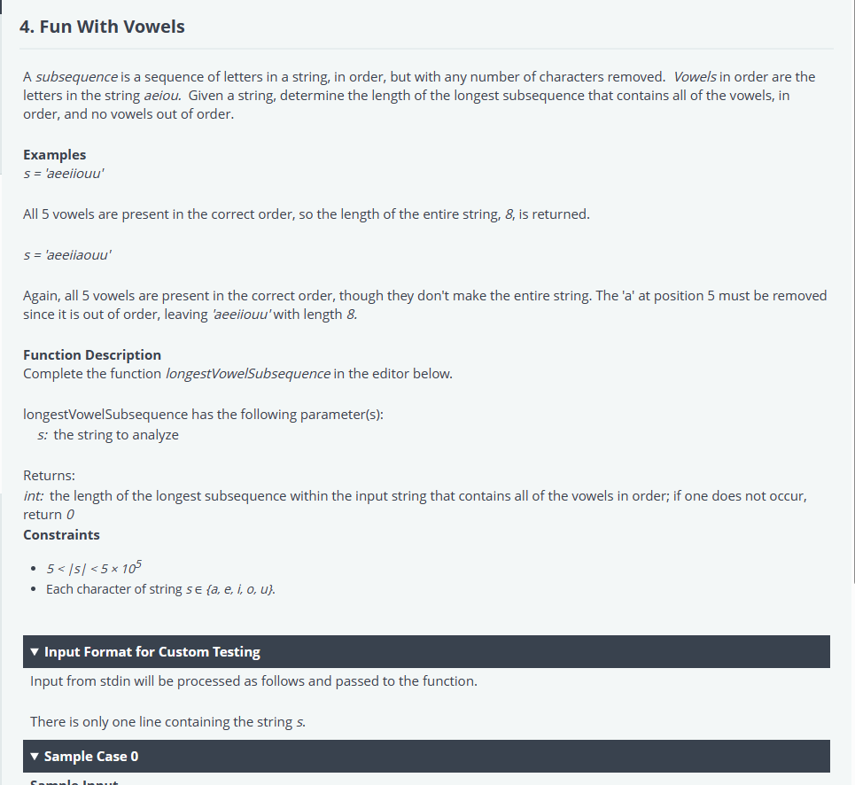
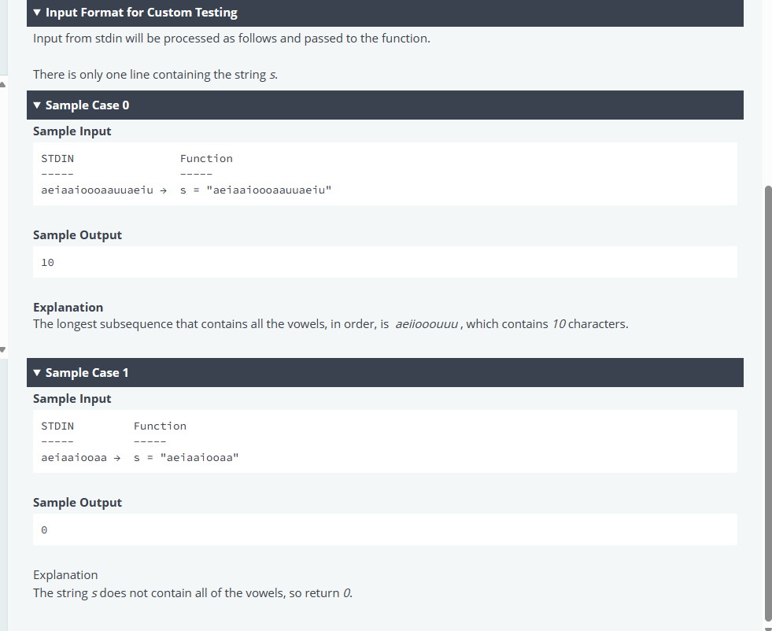

# Mavis Seeds - Engineer Hiring Test
## 4. Fun With Vowels



Python:
```python
#!/bin/python3

import math
import os
import random
import re
import sys


#
# Complete the 'longestVowelSubsequence' function below.
#
# The function is expected to return an INTEGER.
# The function accepts STRING s as parameter.
#

def longestVowelSubsequence(s):
    # Write your code here
if __name__ == '__main__':
    fptr = open(os.environ['OUTPUT_PATH'], 'w')

    s = input()

    result = longestVowelSubsequence(s)

    fptr.write(str(result) + '\n')

    fptr.close()
```

Rust:
```rust
use std::env;
use std::fs::File;
use std::io::{self, BufRead, Write};


/*
 * Complete the 'longestVowelSubsequence' function below.
 *
 * The function is expected to return an INTEGER.
 * The function accepts STRING s as parameter.
 */

fn longestVowelSubsequence(s: &str) -> i32 {

}
fn main() {
    let stdin = io::stdin();
    let mut stdin_iterator = stdin.lock().lines();

    let mut fptr = File::create(env::var("OUTPUT_PATH").unwrap()).unwrap();

    let s = stdin_iterator.next().unwrap().unwrap();

    let result = longestVowelSubsequence(&s);

    writeln!(&mut fptr, "{}", result).ok();
}
```

Typescript:
```typescript
'use strict';

import { WriteStream, createWriteStream } from "fs";
process.stdin.resume();
process.stdin.setEncoding('utf-8');

let inputString: string = '';
let inputLines: string[] = [];
let currentLine: number = 0;

process.stdin.on('data', function(inputStdin: string): void {
    inputString += inputStdin;
});

process.stdin.on('end', function(): void {
    inputLines = inputString.split('\n');
    inputString = '';

    main();
});

function readLine(): string {
    return inputLines[currentLine++];
}


/*
 * Complete the 'longestVowelSubsequence' function below.
 *
 * The function is expected to return an INTEGER.
 * The function accepts STRING s as parameter.
 */

function longestVowelSubsequence(s: string): number {

}

function main() {
    const ws: WriteStream = createWriteStream(process.env['OUTPUT_PATH']);

    const s: string = readLine();

    const result: number = longestVowelSubsequence(s);

    ws.write(result + '\n');

    ws.end();
}
```

Go:
```go
package main

import (
    "bufio"
    "fmt"
    "io"
    "os"
    "strings"
)


/*
 * Complete the 'longestVowelSubsequence' function below.
 *
 * The function is expected to return an INTEGER.
 * The function accepts STRING s as parameter.
 */

func longestVowelSubsequence(s string) int32 {
    // Write your code here

}

func main() {
    reader := bufio.NewReaderSize(os.Stdin, 16 * 1024 * 1024)

    stdout, err := os.Create(os.Getenv("OUTPUT_PATH"))
    checkError(err)

    defer stdout.Close()

    writer := bufio.NewWriterSize(stdout, 16 * 1024 * 1024)

    s := readLine(reader)

    result := longestVowelSubsequence(s)

    fmt.Fprintf(writer, "%d\n", result)

    writer.Flush()
}

func readLine(reader *bufio.Reader) string {
    str, _, err := reader.ReadLine()
    if err == io.EOF {
        return ""
    }

    return strings.TrimRight(string(str), "\r\n")
}

func checkError(err error) {
    if err != nil {
        panic(err)
    }
}

```

Java 17:
```java
import java.io.*;
import java.math.*;
import java.security.*;
import java.text.*;
import java.util.*;
import java.util.concurrent.*;
import java.util.function.*;
import java.util.regex.*;
import java.util.stream.*;
import static java.util.stream.Collectors.joining;
import static java.util.stream.Collectors.toList;


class Result {

    /*
     * Complete the 'longestVowelSubsequence' function below.
     *
     * The function is expected to return an INTEGER.
     * The function accepts STRING s as parameter.
     */

    public static int longestVowelSubsequence(String s) {
    // Write your code here

    }

}

public class Solution {
    public static void main(String[] args) throws IOException {
        BufferedReader bufferedReader = new BufferedReader(new InputStreamReader(System.in));
        BufferedWriter bufferedWriter = new BufferedWriter(new FileWriter(System.getenv("OUTPUT_PATH")));

        String s = bufferedReader.readLine();

        int result = Result.longestVowelSubsequence(s);

        bufferedWriter.write(String.valueOf(result));
        bufferedWriter.newLine();

        bufferedReader.close();
        bufferedWriter.close();
    }
}
```

JS
```js
'use strict';

const fs = require('fs');

process.stdin.resume();
process.stdin.setEncoding('utf-8');

let inputString = '';
let currentLine = 0;

process.stdin.on('data', function(inputStdin) {
    inputString += inputStdin;
});

process.stdin.on('end', function() {
    inputString = inputString.split('\n');

    main();
});

function readLine() {
    return inputString[currentLine++];
}


/*
 * Complete the 'longestVowelSubsequence' function below.
 *
 * The function is expected to return an INTEGER.
 * The function accepts STRING s as parameter.
 */

function longestVowelSubsequence(s) {
    // Write your code here

}

function main() {
    const ws = fs.createWriteStream(process.env.OUTPUT_PATH);

    const s = readLine();

    const result = longestVowelSubsequence(s);

    ws.write(result + '\n');

    ws.end();
}

```

## Test cases
```cmd
0
Expected Output
10
Debug output
s:  aeiaaioooaauuaeiu

1
Expected Output
0
Debug output
s:  aeiaaiooaa

2
Expected Output
21
Debug output
s:  uioieeeaouiiuaeeuuiuuauuauaeaeuauaeaaiuoiouaeuiuuoooaeeaioeieoeooaeuooae

3
Expected Output
12
Debug output
s:  eouiuaaeiaoauaoaeauieeoiuiuiu

4
Expected Output
82
Debug output
s:  iaaieeeoaueuaaaaieaooiiuiaueeoauiueuaeiaouiueoouaeeioeieoeeiiiouiaioiaeeaaaeaouiioiueuoieeoeoiuuuouiaoeaaeeeiueuiueiaieuoueoeooiuoooiooouuuoiuoeiuaouoeaaaiaeueaiaeouuaeioeoaeeuuaeouiauaiaoioueeiauuieouoeuoiiooauoeaoieuieiaooaaieuoauueoeueeauuaaueeeeeoooouueoiaauooioioaeiiuaiueeoaeiuiaouieiueuae

5
Debug output
s:  uuoeuoioiaeaiuaaooeeeeouuuaaeeiiuoaeuoeueeiieeaouuioeieuueeaueieuuiaiuaiaouiouaeuoiueoeieeoeeiuoueueaauouueaeeaoeoeiaoieoueiuoueeoeiouaeoouieiieooiauoiauiuuu

6
Debug output
s:  ioeueooeuieoaioeoooiioieueoaiieaeaoeioiiaueueiououeiueeaaueeueaeoaaaouoeoieouaauooeuuoeauuaauaeoeeuiueeeuiieooeuaooeiaeueaaaaiooeaoiiiaaaooeiioaiiieieauaoeuiiueuioouuaoaioeiaiaaaaoeeaiuiaeoiiuauiiaeiuuaoaeaaaaeoeueieoaaaooueioaauieieouoeouieaueuuaiiueoouioueuaaauaoeueuoouieuuouuoueoaaeuuouueieuouiooaiuaoeuaeiaueuuieeiuaaeuiuuiuoiaiaeauuuaeeuuuuoieoieuaoiiuoeiaeaeeauoueaiuooiaoaiuoouoeeueeuaoeueiaiioiouueeaaoeoeauouuieeoaoioauieeeieeaaiuiaaeiaeueuouuaoaoiiaoeoaoeuieeouiiiiauauueaeouaeeeaoeaaaeouuueoeoiueeoeiouaoeaaeeoaeaiiuouoaaeiuaiaeueuauaoauueuoeueueauuuueeeeuaouaaueaiouoeuooeiouoiiiueauauaeuaauuoeuoaeeouoouoeeeoieoaouiaaioiuoeuaaouuiioieoiiaueueuieouaiioeuaeoeieaoeiuooueeoeuueueioaoaauoooiiueueooeuouauuaiuiaoieeeeoouoeiaaaeieiooeouioeuooeeiauouueiuieaeaieeooaoeiuu

7 - chuan
Debug output
s:  uaaauoaoiaaueaoiaioaeooeooaoiiaaeeoeoaueuioooeuiiaeuiaaeoeuieiuoouoooaoauieueaeiaaiooeeueueoooaueuaoieuieaaaouoeoeaiuuaeouoouuaoauoeieoauaeeiuaiaueeaiiooouoouuaaeiioioooaaeiiiouuiiiuuuaoieaaeuiauaeooueiiaaueoiuuuiuiaeaaoeaaouuooeeuaeiuoooaeiaoeeaueeooeoiuaueiaaaaaeaeuuaoueieoeiioeueiueioeoioiueiiaiaueuaiueooiauuiieiiiueoeeeuaaoeoieoioiuaoauiiieeaooouuueeioeoaeuiuuaeuoaaueuioueaoeiuoioiaaoaeeauioeiioueioeaeiaieaiieuooieouoaooeoeiuiaaeuaouiiuaeueaiaiiaoeiioaaaeooeieaaiiaouioauiooioeeuieaieiauuoiaioaooeiaeaaeaiuiaoiiiuuaeaouooeauiuueaoiuuuiaueoiiaoeaoeeaouieuuuaaeiouueeiaoiuauiieeaoauoaiiuaoioaiaiiaiiieoeooouaoeiaueaouaiaaaiieaiiauuieiieiuooieaououaeuoaoeiuuoeioaiaiueiuuoeeauioooueauueuieuuueoouuooiaaueaueuoaoiiaeuaeeieaeoaiuueeaiiauuueaaaeeaieeeuieaiuuoaoaaueiouaiaeeoeeueuoauieeaeaiuaaueueioaeoeeaoooooeeiuaiuaaeieuueiauuuoouiiaeaiooiiiaaoaauuaiaouaiiiueaioaeoaaoeeeoiiuaeeueeuoeaiieiuaooaiauoeuooouoouaioiaeeuuuieiaaeaoauauiaaeeeauoeeuuuooiuuiaiaaeauiiooooooiaeiuaoaoaieeaoeaeioauioeueuieeiuauooaueiieeeaoueuoauioeeaaieaiaooiooaiaaeiiuuaaaeiuoioeiuoaoueiaiieiaueiiaioaooaaeeuaaeooieeauieiuaeiaauueieaeuuieiauoeoeoouioeoaeeuuaoiuuiiueaaeuoouoaooaaieoieuieuuauoiaieoiioieoiouuioeoeeieuaiouueeuuaieoauoauoooeieieoouuiaauoauoioiuuoioouoauuueaoooaoauuaooiouuueauoaoauuiuaeaeeeuieuueeouuiiauuuieieuoaaaiauiaoeoaoiueaeuaoooaueeeoouoeiuiaouiioiuaeuiueeoeoeouoieoiooouoeaeeeoiuaouaoiooieaoeaiuiuiieeeuiooiiooeiauaueuaaouooeiaeaoieaeaeaeaaeoaieiauuieeeuoeauuoiaeiaiuuoaueuoiaueiauuiiioeoiouaeieouaeoueeeoeuiuiaeuiaiaaoeuaaaeueueuueioauuiaiueaiaeueaiiiueiieuaaeaaeeoaeeeaeeooiuiioaueeouaioaauoouoiuuaoeiiaoiieiaoeiuooiuouuaoaeiouueieuoaeeoiuaeoaoiuiaeaiiaeiuaeuioaaeeeoeaeaueaooeauuaoeiaiiueeeaoeeeeuoiuaeeueuoiaoauuoeiiuooooaeeauoeeeauooiaiauoaeaaiuoeooieaaeueeoaieaoiieueeuiaaiaioaiouuoaooaeueauiiuioaouaooeaeeuaauoeoaiaiaaouoeeaeiiiuaieeoaieuuooiiouoiaoaiuuiuuiiieuaaaaueieuuiiaeieeoeaoeuaaoaoeiiuuoioeeieaauuoauiioeiooaeaeoiuuuiuoeeiououueiiauooauaoeeoiuuaoueaooiieeiouaeooieaueeuoieiuieeieuoiueeoaouauieaeeoauaeieueeieiiooeiouuoeaoueaaioouaooaoeuaoaeiuuieuaueuaeeuoooouauaiauiaaiiuaaeuuoaauaeieaaeueuooieeeeueoiiaueoaeuuauoooouuaeuaoiuuueaaouioaiouiooaeoauoeeaeoaiaauuaoeaeiieuuaeeaauiiaueeieoueueaieieouuiaueiuoouuiooauiueoaaiuaiaaueoeoiaioeoauueoeeaeoiueeaoaiieououauoiiaeiaaiiueoiiuoaoeieeiaeoooeieeeeoaoeeeauieuaaooooioioaeuoooiiiiaaeioiuuaueoaoeeiaoaeaaueuuuioiiuouoeiaoueiiuaioaieuaeeiiaiiuiiooauuoeiaauuuauauiuooeouoeeiuoauauuuueeeoaeouuiueeauaoaoaeuoaoeeieaauiaaaioaeaaouaiueioeeaaoaeioiooiouoaooueauioueoeoiueuiaouaeuoauoeaeioaiououaeeoaeiaoeauueieooeiiuoauuueeaeooaeioeiooeoeoaoaooeeiaeoeieieuaeoieaiuauioeiiiaiuiauiaioiouauuaoioououeoeoieeoeeouaeoeeioiioeoeiauieueeeaiioaueueeoeoeeeaoeaiuueueaoaauiaoueeiieoooioeoeioaeouuoiaouuuaoeuaeoieoiuaaieeauiiaaeoaaaauaaiiiaaieoieuoiaouiuoeiouuiuaeuuaiiuuuieoaaiuaaiouooaeeaioiiiiaiuieaoaoeaeieuaiaoaeooeeaiaoaaooeouuoeuiieuieiieeeuiaeuouiuoieiiouuieauuooeoaaeoeuuiiueaieieueoaeaoaueaooaoaueuieauaoiaeuaaeoeeueueiuiuiaaiouaeeeoooeaaeaoeoieeuoueauoeaiueiaeuoouaeuiouoiaooioauuuiiaaeeaioaaaooieeeaoaeoeeuoaoaeoaueaaiaeueiioeaeeuoouoeeuiiaooueeuuoouooaouoaaoaaeuoeeooueeuiauooueaeaaeioeieoouaaiaoouaeeieoeooouuiiooioaaiuuoueoeiiiaeeuuaeauoeeeeueuueoieeouuueiiaueieeioiaueuoioouoieouuaiueeiuaaeioeaaaaouueiuoeeeeuioouoeouuiiieauuuooioaiaaeuoaoaooaoeuioueoeaoeoeoieeoeeaiooaieuaeoioiouiuieeouueoauaeiuiaiuueoiieiiiouiueaiaiiauoeiueaeuuuoueueauaueoaiuieaueeaiieuiuoiaoieaiaueeueaeoioieoioeeeaeuiieeuauiueuouiaeouiuueoeuuuaeieiueiauaaoaeaoeoeoeaaeeooaeoieooeuuauaoaaaooieeuoaooeaoeuauieiaeaeoaaiiuaiuaaueeouoaaieoueuioeoieeeuuoioauoioaaeueaeuueeoaiuoaeaoeoaiuioueeeioeeuoaueeiiiauiuuuoeeauuoeeueeoeiuuueooeaaouooaeaeuiueueoouaiaooaiauueaeooeaueiooeeuoeieiooeooioiaeiuouoauaueeiuaoeaoiiuooueaeeeaoiuaeiaaaaiouaoaioueaiooaieoaeoeuaoooeiiioeeeuiioieuaoauauaaouuiiiaiaeoeoioaouuoaueaaauiieuoeieeiiiaoaaooooiooeuouaoieeeoeoeiiuoeeaouooaiieeoaaiooooauiuiuaieiueaouioeaeaoieaoauaaiuieuioaaaieoieieeuaiaeeiouiaeeieiioaueouuieoouiieaeeoeueiiieauoueiuoeeeuieoeauauiauoieeoioieuueaooeioaoiauiiiioieaoiuuoeiouieeaouoaoaioaaeuiauiaooiouaauiaoiieiuiauiieoeaaoaioioeauuueiuauauaaeaiaiiuiaaaiooiiuouaaoaeueuaeaoeaoaeiiauiueeiaoiaoauoeuoouaaoeuuiiaoiouoouoiieeuauuaiuueiaauuuaaoeeoaooieiiooeeeiaieeaeoaaoiueaaeooauiooaaiauaaiuieeiaeooeeeeiuueauoaoaeiieaiiaoeoiiioeeaauooiaioeiuiiuaauueioauoaaoueuuoaieiooeueaoeuiiuuiaieaiiieauueuoeeaaauauauuueeiaaooaeouueeueuuioeueiueuuueouoioaieeuioeoouuaaeauaueeeieouuuoeeoeuuoeauauiiiuuaueaaouuiuiuuauioueeaiuaieoooaouoiiouuiaooeaouaieeauiaaiaoeaiiaauuuauaaiuoiouuaeieaeouioioaiieoeuieauaoiuuiuooeaioaaouaiaoueoeueioaiuieueuiioaueeiaueuaeouiiaeaiiaoueaaoeeauuoeiueaoaaueeiooiiuoueieuiiaeieuooioauuaiueeaaiiiauuioiieuoooioioeuouoaeaaiouoiauuuouuuuieiueoeeoeeiaooaooauiouauiuouauueueuaaeauoiaoeeaiioaueeeeaiiouaueaeueeeaiaueuauaaiueoaaieueueuiaiuai

8 - chuan
Debug output
s:  aoaaeaaeiiiioeueieuueieuaieiiauaaeaieiioaoooeaaioeeaeaoauoiuaaieoeeaaaaiaeuuauuoiaeeoiuaeuaiieiuuuoiouieiiuaoaoieiiuuuiaooaouaiauiuuoeauiaooaaaueooiouoeaeiiuaiieoiueoiiaiieeeuiiuoooeuuouiooiieiaoooieoeuaaeaoeiuiaeaieaiooeoiauuuoauiueiiiouuaiuiueuuuoooaiooiueuieaieuoioaaiiioaeoaeoouuaioouuiuiueaooaiioeeeaoaaoaiioiauaiuiooiuaoeeaeeoeieaaaueieeeuieooueieeauuaioeaeieaueoeieaoeeuooiooauaiaauauuiieaeeieoaeeiuoaiiuiiiaoooaoeieiioeouieeuiaaieeaeoiaeoouuaaoeuoeoiuouuiuooooeiaeuaaaaeuueaouuueeuiuiooiiaeieaiuaeoaoooeuuieaoaoaaaeaeeaiuuoaeoouuuooauaeiauueaiiiiioueuaiuoaaeieuuoeoaoaoaeoiiuaeaaaeeoiuaoooaiuaouaeaauuouuaaoauuauiiiuauaiaooeiaaoiueoeaauioiaaiuioeoiaoieaaaoiaaieaaaoueoaiaiaeioeuooieoiaaoiueoeuuaiaioeuiaoouueeuuioioeeaoiuoeiooiiioouuuueeeieaiooouoeiaeiuoeeiieieoieeieoaoaeoeoueauuuueeiaiauoauuioeuoeoiaoeiooaaioeueeoauuaaaoaeaeeeaaaeooaiaououeeouiaaoeiieuaiuoieauiieoooauuuoaeoeueoaueiauaooaoeuiuiiaoeaiaueuueeiiauaeaueaaaieiuaoaoeeeoeooioeuiiiaaoioieauueaeooioaeeoueeeueoeaeaueaeeuooieeaoiuoaiiauoaoioeeaiauoaooeeiaouiaiuuaieoauooiueioeaiauauioioueueaauoioeeoaoeuiaeauieeeiaeiueieaaiooiuaiueoeoaououooaioaouaeaioiouiaoaoeoeoiaiiieauiuoeuaiaauioioeooiuooeueuuaeieeeiuaiiaauaoiauaueuoooeeeaoeoaoauuiieoaeiaeauoouuiiiuiouaiiauauaiueiuoieuaaeoioaoeiaooiaeeoauoiiuaouuuaaiiueeaiaoaiueuuoiiaouuouaaeiiooeoaauauaueaiaiieaoaaaeeeoueioeuueueaeeaeoeieuueioeaieuiiaueoouiaooaueiuaoeiuoauiaaaouaoueaaaiueoeioaaueoeeeaaiioueiuooieiiiueeooaaoeeeoieueeueuieueoouieuaiioiooiaiiiauoioaoieuauuaaaaauiioaiuoeuaouiueuaeieaiauaouuiiuueuiueuuoeouuoeoaiuoeoaoueoieuiiieieuaoueaaeeeueaueoooaeaoeoaaaeiaiuoiiiuauieuuaoioiieaoeeaoeoouooueiauoeoeuuaeeuauuauiieiaaeiuiaoeuoiueaeuuiaouaeoeeuoieaaaiieaaieauiooaaoiuaeoaieiaaoeuoaieouaioaauiaoeaoaeeeieoiaaeuoiaeuaouuoaoouaooeioeouooaiaeoaaoeaaauuieeuueueiaeauuiooaeieueuoeiiiaaoeoaaaoiueauieiiiueiiieeeooioiuuoeoieiuiioeaieaiiuoueuoouoeiaaaueueeoeeiauuiuoauaiaoioeuioiuaieooiuaiuuuuaaeiuiaeaueooauuoiaueuiiiuoaiaeaaiuooauaeoiaeaiaiuiauaiueiauauaueiaoaioauaouoaioeiueoouuaaoiieuiuoeuueuiaoooaeuiuieioueouieauuoaoeoaoueauuoieeiauoiaiaaiaooaiaaoiueuueuuuoaaeeoeoouuuioieeuiuoieoooouuauaouaoeouauaeeaiiaeeoaouuiiooaaeueooauauaoauuoeuiuoaiiooeuoeioouioeoiuaouiiooeaoueaoeiaueouuaoieueoeeauuioaeiuuuieoeooaauieeaaaooueioiueoioeaauieueoiiueaiiiuauoeiiuuiaoooauioueiieeiuoauiieiouaoioaiuoiieuiuaeioaoaieuououuioaiaeeoaouaaaeeoieaoeaaaeouiuaaauouauaeuaoieoauiiueuaiauooaiooeeouoeeiuuaiuuaiooeouioouauoeueaaeoioiieeooueauoioeeueiuaeiiieiieaoueoeaaouiaeoioaiaiiuoieeuooeaaeeaoooieioeueoaiieeaooeiiouuaeeuaiooauiaaeeeoiuiooioueouoouuaiaaoiaouuueooioaioeoaoiuaiuuiiaeuoaiuoeaieuooiooiaeoooeoieaeeuieioeeaoooeaieiaoeueeaoeuaiaieooieieauaioaoaouoeouiaeaaiooioieaoeaaiaaeoouououauuuuuueaieiueoiiueauaaeooiiaeaeeoeaaueiaioeiiaueioiauaeuooiiuuuoeooeaoiauaoiuaaeuoaueeoouoioauaeiuoaiioaaiooeueeaouuuuieaieuuoeeiouueieauiiouaouueaeueauauoouuuaaouoeeauiiiaeoueaaoeueaeioiiueioeaiaeeuuueuauaioaaiuuuaoeuoaoeaoouaaaiuoauoaeoouuaaeauueeuueooaeiouueeuuioioeuiieioioaoeaauoaoeuaaiaeaooiiauiiooeoaieeaeaeaeaouuiuiuueaauoiaauoauiaeioaoaouaiuoiuuuiooeouuioiiouaeeoeeaioeueooioeioaeauoaaioiiaauaiiouoaeoeeeeuouiioueouaauaaoeuoeueieeaieuouiiaaiaoiueueiaiiauauuaaaoeauoiuioeaeiaiuuuiaoiooeuooauuauiauiaeoiaioeoeaooaauaouoiuioaeeuoaeeuoaeaaiaioeouiieauaiiaiueeeoiauouieeeaieoeioaueuooaaouoioiuaaieiaioeiueaueuiuoaioueaueauoaouaeoaiuauoauouuioaoieuaaiaaaiiooeueuaaoeaoeaauueeoeooeoieeuaaeoouieioaaeeieoauiooueoaueeeueueeueauaeiieueieiiuoeaaaouiuauoaaeioiiiuoiaieauoiiiuiuoeeueeauaiueieoeeueeoeauoaouiuoiieaiaeuuoaiueuueaeaaaaauoeiiaeouoeoaeeoieaeuaoeaoaeeaaueaoeaooeoeouueuiiioioaoaeuaiieuoeoaueuieoeeaoiuueoauuoiaieuoeauaeoiieiueeuauoiiuuuioaieuooooiueoioieeaiaaeeeeeaaeeeiaoeoueoeooeieiaiaeeaoeeaeieaaoiuaeeeeauoeeiooeeiiaeeieeeiaeiuoiaiauauoaoeoeaauieioaiuioeaoouauaauoaaoieaaoieieuiueueiuuiueoieeoouuuaiuaoeeeeeieaiuoaiuaeoeiuoeiaueieooiauoioouaeouaiaeauueooeeiuaiueiaoieuoeoiooaiaeuauoieoooaueuuaoaiooaeiaeaaueuiiaaaaiiuaeaieooieuiiiiauaoaioeiuoaeuuaaaiiuuiaiaeeiiueuiouuuieeueuoeiaaiaiuoaueaouueuuuiuieiouaaouueaeoeaiioieuaieuiiouaiaeaioooauauiiieoiaaeaauaaieueeuieaaiaieaeaueuauuaaaieieeaiiaauuiiaeoaiaoaaeaeeeauiauaeiueoeeeoiouuaauiuuiiiuaeueeieuoeaeaouueuuoioooeeeauooiaiaauoaooioeuaoiiaaaooieuiieiauiiaeiiuaeuiauiuooaeueauoeuoeouaeaueuaiaoaouaiouioaueaieioaeoaiaeuaieaoiuieaueouieeaoeoaaueeeaiiiaooiuaiaiuuuaiaeeuooooaeiooooeieauiaooaoeuoioaieaieeuooiaeoiuauuaeaiiaaeaaoaiaiiaeaeouueueieiauaeaouiaeaieeaauoaeiuaiaeoueiuaeeoeauieuuieauueeeoieaoouooeeoaeuuaoauuoeiouoauooiiaeeaoieeauiiioaeuaiaiueieaouueueaaaaeiuueoaeoaauoouiioieeiuoauouoeuuiuoauaioaiaaeiouiiauoaoueaoouuaoiouaeaeuiaauouoeaiaieoeueeieuooeooeuiouiuuaiiouueueeuieeaaiaeouoieaiaueaeuuaeiauoieiaooooooauaiueuaaaeeiaaieieeauauouuiiaoieaiioiiaueuiaiouaaauaoaeeiiauiaauuoaaeoeaoiuaaoeooaaeiuioiuoooiuaooueieuiueauoouaaoeoouoeoueoaeeauoiuieeeaioiuaaiuiuuooeaiaaaoioauieeueauoeeuiieouiaaiooeaaeiioauiauueiuoeoiiouueuoaioiaeooiaaaiiaaioeuiaoiuoeoaaauuaeiaioiaeeuiioeeeuouiouueouaeueeieuaeaaeaiooeouaoiuaaiuaaaiaoeieeuoeiuiuuaieaeoiioaiouuuioeuooeaeiuuueoeoioauoiaeuooeiuauieaueoueoioeoaaieaaiaoouiaaueaeoeaaouiiiauieauiuaaeiaueieeeoooaeeieaeouauoiaoueuiiauuieuueeieeuuoeeaeiouoauueouuauaeiiaaouieueiiuuuuouaueieuaaoouoaeeuuuoooeioaoeieeueeoaeeiiuoiieeiiiiiaoauouiioioiaeiieuoieeeiieueoiaeoaueeaeeuiouaiooouoioeuaeoueeaeueuioaiuiuaieueueauueeaeaiouieaueioaeeoaeuoiieeiaoeeaioaaauieoooaaaueiuaeeeuoeeouiiuoueuaeuuioeeeuiuioooeiauieoeeiioeiooiuooeouooouuoauiaeaaiuuuieuaaoaoiioauuaueaooeuiaiiiiaauoeauoiuoiieoouiaeaaaieaiioueiooaaueeeooeoaieieaeuoouuuuoouioiaauooeoiiooiiaaoauaooioeeeaooiaaeeieaooioeaiuueaoaoiaiuaueuoioeouuauiuiaooiaaooouiiueoueoeiuaoiueaoaeuuuiooaeuiooaaueioeeeuaiaouoiiaaaoeaaeuuiiuaoauuaeoeeaeuieuoioeiuoiaiieeuuiuaiueueaaaieeeeoaeaueieiuoaiuaiaoueuiiaeuiaiuauueaaiaeaeuoeiiieaeaoioaiuaiuuoiaaieiieouaaeaooouuoaeaeaiiuooeueaauuoooeoouuiieuuuieauuoiuaieoieoaieioeuiuueoieuuooaeieeieooeoeuuoeiiaoiaoauoeaeeoauoaoaeiueeiieaiiiioeeuieoiiieuooeeuiiueauooieaoueeeuiuiaeaeoaeeouueiiiiooeeaeioaauieaeeioooaieaeiuieaueaaeaioaeueououiaiuiaiioeuiiuaooeuoieeaoieeiooaoeaauuoueeouieeaeoaauiuiuaueiiauuuuaaiouuaeiiuueaueuuuaeiieuuooaeeauieuoeooaaueiouuieeeeauiaauuouooeeuaeeeeiieaieaaeuiaaeoiueiiiaiaauuiiuuuiuuieeuioeaiuuaoeuiuooaiouiaeueiaoeaeaaoeeaaeiueaaieueououuaaoauaoeiiiiuiaaeioeiauaieueaeeaueeieueeaaouueeaaaoeuoeiiiuuuuioeeiauuoouaeaieuoeeeuaeoioaoauaaaieaiiieaaueoeaioaeouaeeuauuueeoeueoaeaieiauuoaiuiaiuuiouaaaueieaaaouauaoieeeiauioaouoiaeeuaieeaeuaiuoiiuoeuueoioeuauaueoeuuuoeiuaeooeuuueueueaioiuoiiaueeiiaaeueoouioiuiuuoiieaooaooaiieauaaioioiiiuaiuiooiaouooaaoeiieiuaoueoiauooooaaauaeeaeiaeuuioueueaeeuuoauueeuoieioieueaoaeuoeoooaieeuuauaoooaoaaeauoeaeauoeiaiuoiieeauuiaiaeeuiaiauioiooauioaoauiieiaeauouuoueioieeouauoiiaaouooioaeoeoeoeiiieeiaiouoeeioeoauououueeoeeaiuieuiauuueioaaoaaeiueoioiaouuaiaouuoeuoeaeeoiuoeooaoooeuiuiuooaeeuuauaouaaeooouioeeieiouuouoiauuiuaeauuaeuuoaauieaeiaooueuuouuuiiuaaaiiioaaoiaaioueeuuaeiaieueaieeueiiuaouiiueuuiooauioaueuuiaieoouoeeiaeiiioaoeeuouueeaoeiooiuiiaiieiouuuuuioeaiaeoauaeeoioiuiaaoaououaeuieuuaoauoouuaiioueeaoeaeeuaeoiaeiaiueiaaouoaueuooeuaaaueuuaeeeaeuiaoeoooiaiuouuuiuooaaiouieueoeauoieeaaeuaueoouauiiaaiieieaiiuooueeioouiooaioieaieouiieeauooeeoeueuaiaeaeioioaiaooueiuueooaioaoiaaaeuioeieueeeouuoiaooooauoeauueeouioeiaueouuiueuaaoeuuauaiuoeuuaiioaueuuiaaeaouuauieeiaioiaeeouiueaeauioeiuiiueuaiooiuaeuiouoaiuoauiueuuuoeaoooieieaiuuoueauaeoeuioouauueuoeeaouauooeouioiooouuaiaeeuouauiueaiuiuoieieauaooeuioaauuuaooooooooiaiioeuoeieeoiaouoouaoeiiiiiouoaaiueiueeuoooaeoeeuoeoaouiooouuoaoouieoaaeiaeaaoeeiooieeaouiuaioiaaioueauoieoueoiiaioouaeaeaeoiooeaaiuoieaeiaueaeieuaieuaoueeiueieeieauoooauiioiuaeoeoeeoeaaiaaaauuuuaaieoooeeoaeooaeiaiiuieoaeuioeueiaeaeoaiuoeuuoouiaiieueeeiiuoouuoaiioiuaoeuuuioaiaeuuauoueiaeuuaieeeiaauuooiooioiuueaaaaeieuuaeauiooeuioeiiiooiueoaeiiiuauaiaueuaououueoaiaiiaiaaaiaiuaaoooeoeiooiiaaieoeoiuaeueiuoioaouaiuaauooiuuuuoeoeueueaiououoiiieiueuaauieuauoieoiuauuouioaoeuouiuoeeooeoueouooaauuoiuaoeiaaueaeaaaaoeoeaaaiaeuoiaeoaoieooioiuiieaoeeaioiooiiiuaiouueaiioueaaoiiaaaueeouiuoiiauueeiaooiaueaouoieuuieuoieieeooiauiaouieiaouuooauoeouueuiaaaiuooauuoaeeaaeouooueaiouuieuueiiuaioeiaiaoeeouaoaaoeeiaaooeaaauoiiiuauiaaoeeooaioiueoeoiaeuuueiiuaiaaiaeaiiooaoueaeoeioaaeueuoeoueoueeaoeauoeuooioeaiiaoeeeiaieoeaioueuoaaauieoaiaouaioaieeiaoieiaeaouuooooeeiuaeeioooeuuioauioaoeeouuuaaoaueaaeeiaaouoeooiuoaiiaeueiiiuaaieaeaaiuuoaououoiaiaaeuiuoiouaioiuieeeueoiuuouaeeaiiauaiuaiaiieiioooooeiaiuauoeeoiiaaeeauaaoeeeeaiaeoaoueuaeeueaeeoaueaeaiooeeoaoaeoaiaauiiieauuoioueueaooooaiueeauioieuiaaiiueoooaoiueioaieiauaioeuuooaoeeoeiaaoiaaiuuouiaioueieiueiuuoaeoiauueueeeeioeeeiiuuiueouiaeaieaoeeeuiaeiiooaoioiiauoeuuoeuoieuiiaieieaauaaaaueaiioaaeieieeooeueeiuaoauaaeauiaaaaieuoeiiiuieeieuoiuiouioouiioeuuaooiiuoaueioaooioueoiaaeeeeaoeuoaoeiuaaeeuouaoiaioeoioiaieaauoeuieaoueuoaeiuoeioioaeueeueeiauiaoueaeeeeiieeouoeuuaiaieauoueoueuieoueioieauuaaieoiaooiiuoo

9
Debug output
s:  uaeeuiaeoiieoeeeieoeoiuaiouioaeieiioeoeaoeeiioaiouaeoeaeioeaueuioiiueiiaaeoiauooaueeaueuaioioiuoaeaaeiioaeeuieeiiiiiiaiiaoaaiiaueoiuiiieuiaoaeoiuaaooeaueouaeeauiuuoaaeieieaiooouoeoiooiaeuaeiuioiaeeuoeouieaeiaiuuioeaaoeuioauaiiaioueoeiaeuuaooueuoueooioauaeooiiauoiaaieoouuaaoeeooaooooaioeeoaioieiuoouoiueeaauaaeiuaoaeeueoeeuuueoeooieauoueouuueeiuiiaaouiiooieeooaoeuioeauueieuuuuaeaoieaiaoueaoiuuieieaoiiaiuioieuouoouuiauiiaaeaeeuiaiaaueiuoauueoaeaaiouuuuioioooeeoiaiioiaiiaieeuueoeoiueaueueuaioooauioaoueaueiuouuaiaiaaaieieieuoaaoaeaeieoaaueiaeiuioaeaaoaeoooiaeeaoiouieaooiiaeiuiuaiaeaueuoeauieiioouaoeuiaieauuieaiiiuueuauiioiaueeuuaueaooeaeuiiaeeeooiaaeieieuuaeueoueeaaoooieuaaeiuouaiooueeouioeoeuuaoaeeiooooiiiiueouoaioeaeueueuiiooeoooiuiuaeauoeuuiueuoeuauoiiiaueoeoouuooeauueuoeuiaaeeieeiaeuiiaoauueaeaeeuieiaoiioeeoiooeoueuoaiuaeoaoiaooiieiiauueieieeaaaueooiaoiaeaiieeeooaouaueeaiaaiuuiieuiaeaueaaieieoueioaouoaauaieieoiiuueoeauaaooeuooiuiauuueeauuoiiauiiieuaoauoooiaeuaeeeoueaieouaoeoiuaoeouaiuiaauaoiiuoeoeaeaoeauuiaeaaooiiaoaoiuiaooeoiiiaiuoiooeeuaoeeueeaeieoiieioeeiooauuooieaeuoiiiiiuuoioooueioaaiiieeoioiuauueoueiueoaieaaaiuaouoeuiuiaoeeooeooiaaeaeueaeoaueuieauiiaaeueoaoouiueuaaoeueeeiaiuaeiiouuauouueauiiiuaoaaiiauiuiaiauiiuauoieeauiauiuoeuiiooouuuiiaiaieouiouoioueaoueuuoueaueeaoaiooooiaaeuuouuuaeeoueouaeueeeoeiaaoioaieiuoueaeiuuoiaaaoeaaiiuoieiaaoaaiaiaoaeuiiuoiiieaiouioiuoiaeueoeiaaauiuooiiaeaiueueuiuoaoioioiiuoeiuuoaaaeoeoieuaaoiieeeoaoioauooiaooouuioaeauaoiaueiuueuiieeouoeouueeaieaoeaiiououuoioiuuuiueoueueueaioooeuiooiaoiueeeeueoeauieeeeeuaaieaauoooieieoioaiuaoieooeiiueaauooueouuueoueouieoeeueioaoiuauiieouuoiieoooaaouuiauuiaeiaoeeaioeeieeaieoiaaeaeueoieauiuuiaeoiiieuoeuoiiaeeaoioueoiieoeooueeoaioooiuoaououaiooeouaioeaeuuuueiieauouuoiauueooouoiueiuoueoeaeeaiueeeiouioieaaieoaueaoeaieoaoiuueooiooaouuaaoeuieiauaaiauaaioeiuiaouoaoeieaeiiiauaeiouaoiieiauuuoieiouoiaeieeaeouoeoaaouueuaoaiuaoieieieeauoeaoeueeiiuuaeeioooeaaiauaeouoeoiioaeaooaoeuaiioeaoaueuouueooueeaaoiieoeuieaeiiiuoeiaeaieoeuaoeieeooiiuoaiooaeuiieuoaoaoaaaaoaaoieaoaeuuoeeueuoeeieiaiiaeoeouieuoeuaoaoaeaeaooiooeuoeoiieaauuiiioeoaueaiouuoaaaoouuoooeeaouiieueuuouioeeuiuoiuiuiieoioeeiaeeioaeoaeeiuuuieiueuauouoaoaoeeuoeioiauaiuuuaeeeoeiuiiuiiaouioeiuaeoueieeiueaiaeeeaooauieioouuaeuioaoaaoiieuiuuieooioiuieauueooeuiueoeeiiuaaoioioiuuoeooaiiuiaoeuuauiiioieiaaoaiiieaaeaoiuueaeiaieauoauoueaoaiiiaiuaaoieiaiooeeuaoaaaaieaeaeuauuiaioaoiueoeeiaaeoiuoeueeuiiaaiauiueauoouiuaoeaoaiaiaoiiioaiuooauiaueuaioieaiiaauooiuueeoouoiiuuoauaeueieaauuuuueooaoiioiiauaaiuuaaoueouiioaiieeauauaeuaouueaeoieeiuoouieueeiiiauaauuueiaoueaoaoeuaeoeiuaoueeeeioooeiouoeooiuiaieeaaaaiaeeuoaaiaoiauooeeaeaoeioaaoiioaiaaiaueaeauuauuaeoiueeoiaaaoiuoaoieuaeeiauouieeouoouoeiiuuoaoeoeoieaouiiieaeooouaiuoeuaooieoooaaiauoeuieeiiauuuaeooaiueiaauauuoiiooeaiaoeoaoaauuiaueeiaauuuuoaaiaaaioaeoaiauieaiiuaaieeiaeieuuooueouioeeuieeeueioeoauaiaeeiueeeuuiueiaeiiuuiuaoeaoeiiioeeiiouoeieaiuiiaueaueouuaouauuoiouoiioioiaaaeaoieaouuioiaeauueeueuiiieuoaaaeioiuiiaoeauuauauuouiuoieiaueuuuuooueuoouaaouaeueuueauiuaoieieeouueoauueiouauaiaauioiuoueaoeaeuouaueuieeoiaouiauoaeiuuiuauieieoaeaieeieeooeuooeiiiaiouuauuaauouuuuaueiaeuiaoaaaeiuuioooiueoiooooauaoeiaaoiiueiieooiioaeoeoaueeauueuoooaiuoeiiooiaieeeeuoaoaeoioioieiaueuaeeuauueaaoaouiueueaaoooueaioaiaeuuouaioaeauiiioaeoeieoiiuoauauaioueioeeuoeuoieeioiuaiiuuueeaeaeiaoaeuaaieoeuooaeeieaieeeaooieaoeaaaouuouueoeuiueiooiouoaaioiueiaooeouuaaueoiuiaoeoiaoaoeioeiiieoiuieeaeaueauaaaaauiououaioaouauauoouaeouieeuiuioaoaauuioieiaaoeueooiiiaiiuaieuieaeoeeaeieaueeoioiiuueaeeouaouuueuouuiaoiiuaueoauoioiuoeoeeuioaeiooeiaieuuueeoauooaoouuoueaooeeioeuiiieooueeoaeoiuiaoiiiiouiaueiaoouiuuuoouoeeiuuiiuuuoueaeeieuaeauuiuiieiieauuoaeeiaeaioeiaoaaueuaoiaaioeaiaeioeaoueaoeeuaiaeouuaaoaueaeaoioueeeeiaeaoeaoooeauauaauiooaaeoueeaoueioooeiaaoeuiueiooooioueeaeoiiiuioeuaaiuaiiouieieeoaeeauiuiaoeoaeaiooeeoueoaieiuaooiuiaioaaeiauoeaoaoiaieuoaoiiuiieiueeaauuuiouieeoaaaeeoeaaoeouoouoaeeiiooiouieuuoioeaaeieoeuuaeioooaiieouuuieeiaooieioaoieuuoaeaaeauaooeuueooaiueaiaiaoiuueueioaoaeaieaiaeuiaauoaioouuaeueeieuieaaooooiaaauaoiuouaaiiuuoieeaoeoiueeeaaeeuieeuiooeieueieouauaaoueuaoeiiauoueoeieoaaaueioeeeeiauaeouaooeeuieiioeooeuooaiooouioiaueeuuoeuaouaeeueeouoioaeeuouaaaiaaaeoeaaaueiueaaieeiuieiueouoiiaeouauaiueaeiaiioaiaeuaueaeueaiaoeuaieueauaioaeaoooaaeooeieoieuueaioieueiaaoeiaiaauuaioiaueuuiuiuiooeoeiaoiieoeaaaaaoouooioiuaaeeioeuaaiiaiaaaoouieooauiiauooeiuuuaoeuueaooeeiuaueaiieaeuiiuuueaueiueioaaiieaaieieiieueeeueuoauoaeioueaoaeiaeiiueuiaoiuiaieaoiieiiaaioeeioaiuiaoueiuieoeaiauueuiioeuoeeeieaeoeoieooaaioououuaeaoaeeeeooouuueoaeouoiouaeeoeouioueoeeeaiuouuiaiaioueaaeiaeeeeeuueiuaeaaouuiaaoioaeoeuiaeaioeaaiuaiooouauieoueoaiiouoeaouoiauuoeouueooeeaoeuioueaaueueoaouuiiaaaieouuuieuooiiuiuuiaeoooioueuiaeiuiaeaeeioaueoiuoauoioeiooueuooeuiouaaiaouoiuuiaeieoooaooiaoieaoooaeiaeioeuaoaoiaeioeuaouoeaiiaoiueeaiuoiaiuaoouiiuoaaueuaoieiiuooiiaaiiiieiuuaioiieouuoeuaouoeuauioiaeuaiuieeieoieoeaeoaeouiiaeaieieuiaeaoiaeeioeiiuoauiiieaeeaeoaeeaeiaueiuueoaauaaoeouueiueuaeeuaueuaaaeaaoiaouiioeeeauuiuuiiiouuuueeuuuaeooeioiouuuieiiiuaeoeuiuiiaauuoauuaaiauuouuoouioaaeuieuuioouioiiiuuiuieoeeuoaieeoeeiuoieiaooeiuaaeieaiuaooeuuoiiaieueuooioieeoioeaaiaoeuuiaueuuoaoueeiaeiauuuaaeiouoaiaeaiiaauieooueueeaeoauaioueeieueaooaeieueueiuoooouoiiiuooooieieoioueauououeooiuiiauaaeaioooueauoueiuaeueueiaaueeaaaauoioeuieuuioeuauoaoaiiioiaaeiaoeeiaueaeoeeieeuaiieauuuaoueieiuieiiaeaeiooueooieaieiuiouauiiaieeoaiiuouooaiooieouuauuaauouaeuaaoieaeaaueuaiooooauoeiuaeoaooaoouuuaiaoaeeeaeiieiieuouauiooeoeaeaieeaeuoeiueuaooeieiuiiuaaiaeooaaueiaaiaioaeeioeaeeeaeooeaeioooueuaoiaieieioiiouaueiaiaoaiioeaeaiiaoeiooaaaeaouauaooiaiiooeauoeaueuiueoueoeooeiueuiuooaeaeeeaeaauiiaiuiiaeauaaeuoaaieeoeaiaoioaoaueoaeuoeaooeuaeoeoiaeoeuuauuaooeuaiauiooioaaeuoieuouueoeoaaioiaeoauiuuueeeeaaououaiiauaooiooiiieauoeaoeuoaoeiaeaauoieaoieaaiioouuuoaoiiouoeauaueiuuuuueiaoeoouaaeiuaaaiaeiaaiaeiuuaoeiiuaieaauauioaiioiaoeaaaeuaeiieioiouuaoaaioaoeoouoooioaiieaaoaaiuueuoueeeiaioioeauaaouioeeiuuiooeueieaiuuouooooaeaauieuauooaoeooeuaeauoeaeieoaaauiueeieouaoiuuaaeoaeaooeaeuiiuiaeaaeaaoeueeoeuuiououaaaoeuoauuaiooaouuuioaaueuiioeiiaouieiaaeuueoaoeoeeuooaeuaouiaaaiaoiiuaoaiieaiiuaiiaiueieuoaeueauoiiieooeuoaeaaeiueeaouuuieeoeioeeiioiuaeiuoeeoiaeeoueaeeuioeaaiieuieiuiaoeuoiaaeiieiuueuauiaeeouuooioiuiiueoaeaouueuaouioouieuouiouuoouueuuoeeiueaiieaoooeioiauaiueeiaaiaoiiiaooauaieaauoeiaiuaeuuoaueooiuaeeaeouooaaaoeuoiouuiuauoiiuioeuiooeoeaiiiauooaoeoueaeauuooauuueauueaiaoioieaueueooaeuieoeiuuoaaoeooaueuaoiaiiiouuiiuouaueeeeieieuoueouiaeoeueauaiueaeaaauieoeaiiieuiaiiueiaoaeaoeiaaauuueuiaooiioauaiueeeauouooeaeioiiuiiauoiiiiiaiueoaiiiaoiuauuieuaeeaieaeeaiaieeouauauooeoaiieueoiaoaouaoouoouiuaououioieuuoaauaoaeaauoieioaeoiaeaeieouieioioauuauaeaeaeiaaaeaoaoieieuoeeooeoeiiuaaaeaiuoiuiiaueuuuueieoiaoeuiuouioeuuieoaououueoeouuieoeiaiuaieaueuauiuuauoauuiueieaueieeuiuoeoeoaeiuouiaaeauiaueiiiiaaiaoaeuoeeuooaeuooaeoeooaeoieauieioaieoaiueioooaoeiuiuiiuoaeueiueoouaauaouaiuiuuoueeuaeaeoeuueaioouoaioaooieeooiiuuaueaeieeioieiaoeaiaoaueeiiiouuiaeeoaaiiuuuaieauaiuiiuaueauoiaaouiiaaiaiiieiaaoouooaoauoueieooeaoaauueueeaeeoooeoauieeaieioouoiaioiiooieoueaouauiaauiuiouaeaoaiuiiioaeauuuauieoauiuaeeeeioaiuaeueaeoaeuaaieaeauoeiiuauoiouaeoeeuieaieeaoouoaeeeiaaueiiauuoooueueuouioaeioeueiuaiiiiiueioeiaeiauuoeouoeiiuiuaaiauuaooeuuoueeaoieouuooueoeeaiueuoeeaoouiiaeioouaaaeueaiuaeaueaauioiouaeaeoaaooeaaiieuioeiuuaoaaiooieuaeuaoaaoaaiouuaeeuiiioiueoaiiuoaeooeaeuoiioioioaoeeaoueoieauuoieoueoooooaeeoeauaiiieueiuuuuuaoeauiauaeoeeaieiieuuaoiueeuiueaeiaeeueeaeuaeiiuoeooeeaoiieouiooeiiuuoaeuoiooioaueiiiouaioueeuuooaiieuuaoeeuaieaiueeeouaaaioeuaeuieiauuuiueaiiaiuaeeaueaiueiuiiaaieouueuoueoeeueiaoeoaouiuooauioeueueeooueoeuiiaeuooooooiaioiueeuuieiuiauueouiiuuaoaeuuaauuauaoeaiaaeauoaiioaaieuaeoououeeooauoeaooauieeeaeueueuioauueeuiaiooieaeiauiuoeeiieueuieaioaaoeoeiiaouaeoauaaioeueeoaeeaoeeoiaeuoeieoueiooieeueaouiiiiiueaoiiaaiaaiuaeeoioaeouaieeiiiuueuoiiieoeuooaeoooieuiuiuiueuoeaeaiiiaeooaiieiaaaeoieieauooiauooaooiaaoouaoeoeoieeaoaaueooieeeuuiiioiaoaaueaeeeuoeaaaiieaeuieeoiiaaeuieooueeuaiouoooeeaoeuauuiauuiuioiueoiaaaeoaaieeiuuoaauuaoeuaaeieooaooueoeeaiooiaieieoauauoaieaiouuieieueuaeeueaeoauiioeoieooueeiueoiioiuiioeuoeieieuoeeoiuuiueaiaaeaeiauaeoeuoaoouuieiiuaeiuoiuoaeiooeiiiieooeuoeoeaoaiiauuuaouuieoaiaeoeouuaieuiaoeaeaeiaeeoiaooeaoiiiauaaoiaeiaaiaaouauieoieoeeoeeoiiiaaooeeaueeeuaoeieooieaoiuiuaeoouaueauieuauieuiiuiaeaeuaieeuuoouaiooiueoieiauaaaeiaoeouaoeauoooiueioiuoauooooaaeoauoauoeeeeeuuieiiouaaeouaiaueeoaoeeeaiieouaeiiuuouueeueeouoauaeoeueaaooeioiuuaoeoeeeoaiaoaiiooeiuuiuiueoaiauaaoooiiiaaieiiouiueoaiieaoauueiuouaeiauooiiuoeeooeaieeuiieaeuauuaeooiooiaaeuaeiiuiieieeaiiuiauaeuuuuaoaeoooieieuaoieououuouiiuaeaioouooeueeeioeouiiuiiieauuaaeuoeuiaueeiiaeaeiuuuuiaeouaiuuiuuiouiueaiaiaeeooaoooaaeouoiiauaoiuuoaeueoeuuuuuoaeuiiuouaaoeuiuieueoiaaoeiieuaauoauoeoeoiaiuaieeaiuioiauaiouuouaieeieeuioiauiuouiaueeaeeiueoeeaaoieaeaeaoeuaiuioeuauueuouaeeiiueaiiiaiuaioaaaeuuuooioaoaiaaiooueaeieoeiiioaaeieoiuoeuioiiuaaoeuieeeaoiiaeieiooeiaeeiiaiouaoueiaueuaoiiiuaoaiaioeaoeouauaueooiuueaiieiueiieaaiaeoiiiouiaeeaieeaeiuoouuuiaeueeaaiueaaieeeiieaaaiiuoeoeeooiuiueioauaeuueouiieieiuiiaiiaeeoeeuuuouiaauoaaaieuauoieeuuuieiuoeaiuauaooouaoeiueuoooeaeaeuaoueuueoioiuaiaiiiieaueuoiaeuauaoiooouuuueoieeioeaeoouioiuieaiueoooeueuoieueeeoaeieuoaoeauiueueaeuoooiueoueiuauuaiuiuaiueaoeuieuaauaieeoeaoeeiuaueouaiieaioeiiueauaoaooeuoiuioaoaeuioeioiauuiaeieeuiaiieauoooaaeaueaieouuaoiaeuuiuoeooaeieiaiaioiuiiaoiueieeouiaauiieoiieoooiuouoieieoeiaaeiaeuaiieuoiuauaoouuouueiaoaooueoioauioaieuuuoeaiiaaeeaioeouieiioieoeuiuoeaaiieaieoeiieaaieaeiaooouuiaoaoeuuoaiaoiiiiueoaaieooaouououeaoiiaoaoieouuaiaaoeiouaaieeeeuooauuuuaiiieeuiiaaoaoeuuuuiaeoouuioieaaioeuaoeaieoueaeooaeuuuoeiueaiaaeiaeaaaeaaiaiaauaouiiueaoiuiuoueoouiiuooiuoaiouiouuuiieiiuioeuiueieuaouuuioeieeuuaoeouoeeauaeiuooeuaeaoeeooouaiuoaauaooueiouuaaoieooeiuiuaoueuoueuaeeiaaoooeeaaeeiuaeouoouaaeieoeaoeuiouoouuouioaaiaieoioaeieooooeoaaooaouaieeieaaieaoouaeuioeeuoeeauaueiaeeoeoaiauiiuiiiieaioeaaoaiiuouauaaeaeoeoiuioaoeuuieieieeuaeouoouiaoeeeiiiieueoueeueeieauioaaiaaaooueoeaouauoiieaaaaoeaieoeooaaoeuuuuuueoeieoiaooueaiuuaauuaouaiuauuioouiiaeaeeouiaeiaiuueuioeeiiieoeieeouuiiaeioueiuaeooaooeie
```