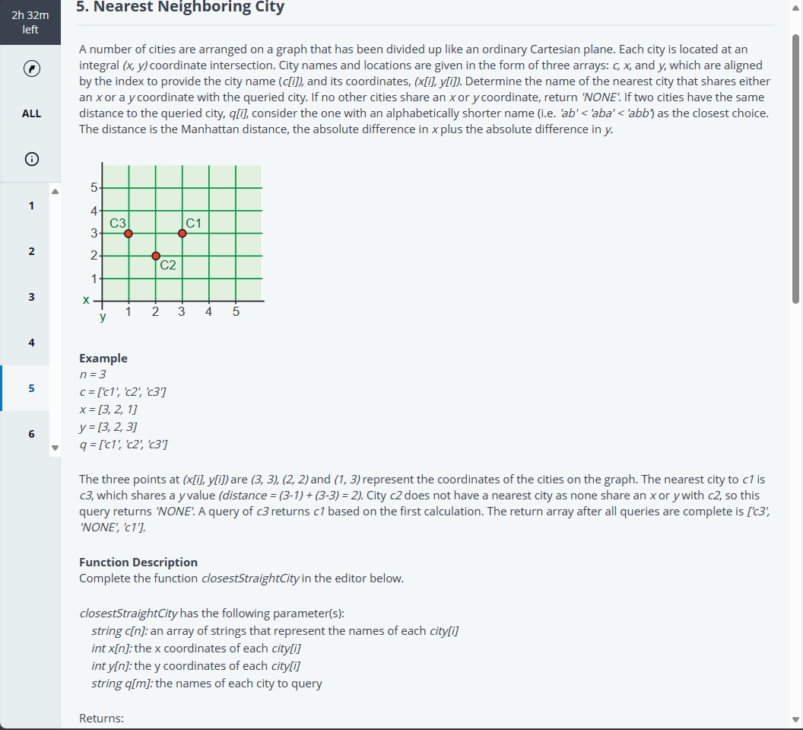
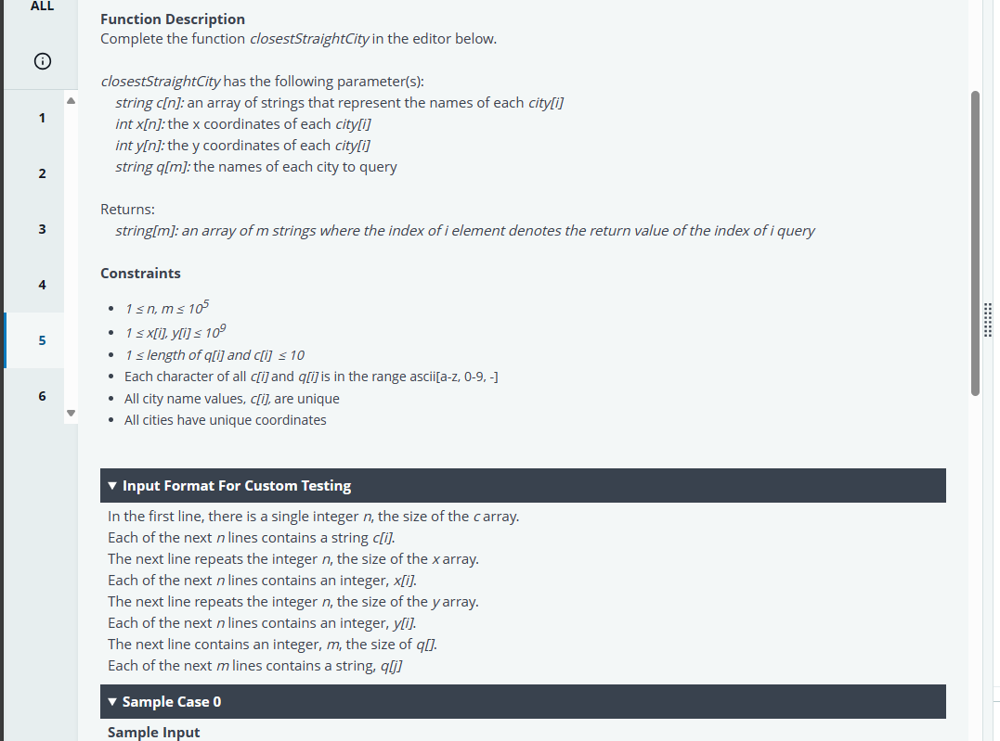
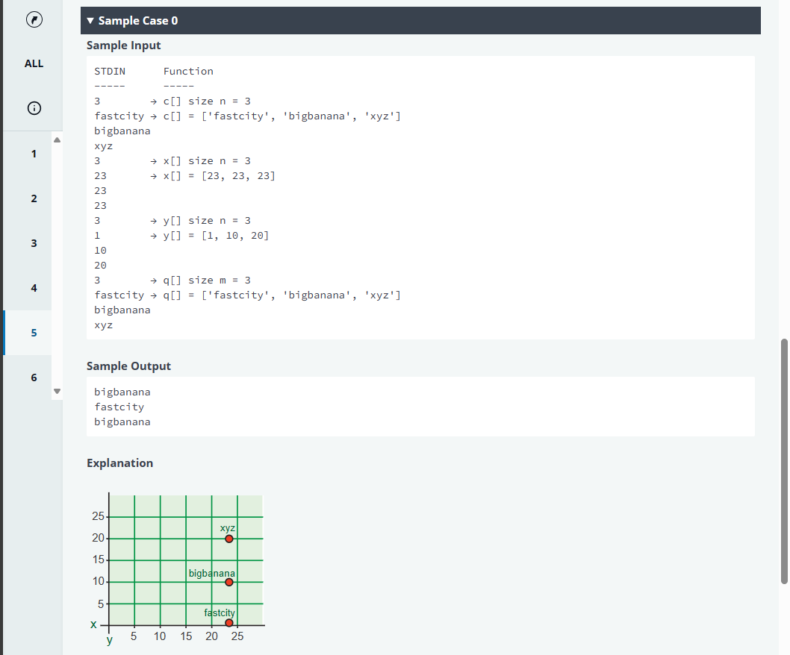
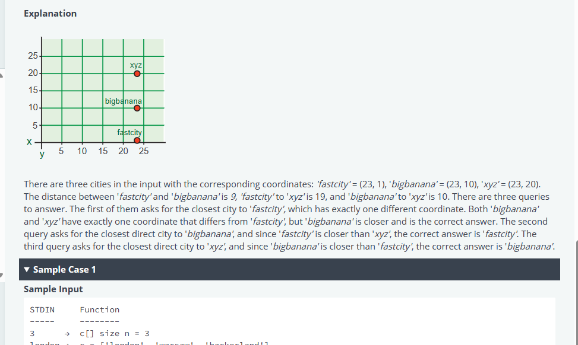
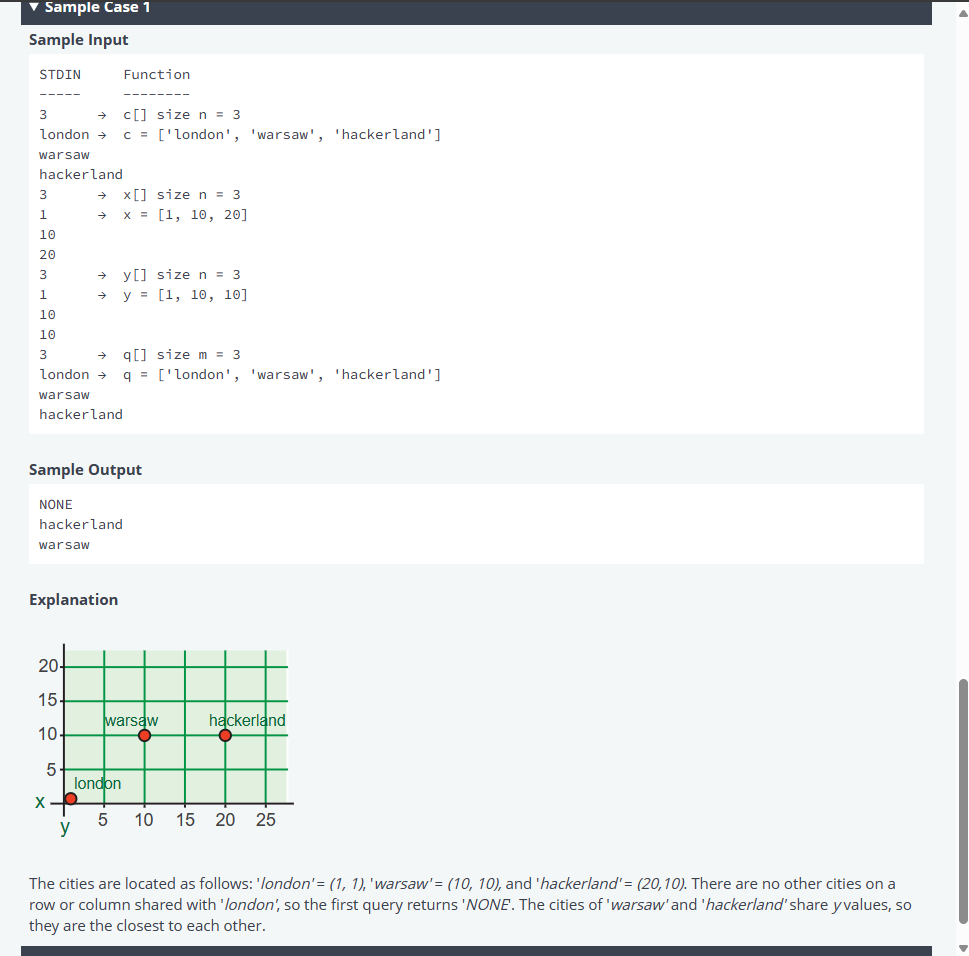
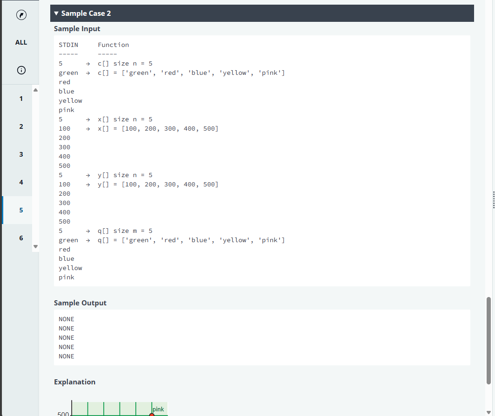
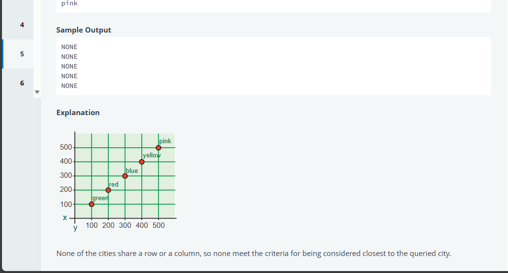

# Mavis Seeds - Engineer Hiring Test
## 5. Nearest Neighboring City








Python:
```python
#!/bin/python3

import math
import os
import random
import re
import sys


#
# Complete the 'closestStraightCity' function below.
#
# The function is expected to return a STRING_ARRAY.
# The function accepts following parameters:
#  1. STRING_ARRAY c
#  2. INTEGER_ARRAY x
#  3. INTEGER_ARRAY y
#  4. STRING_ARRAY q
#

def closestStraightCity(c, x, y, q):
    # Write your code here
if __name__ == '__main__':
    fptr = open(os.environ['OUTPUT_PATH'], 'w')

    c_count = int(input().strip())

    c = []

    for _ in range(c_count):
        c_item = input()
        c.append(c_item)

    x_count = int(input().strip())

    x = []

    for _ in range(x_count):
        x_item = int(input().strip())
        x.append(x_item)

    y_count = int(input().strip())

    y = []

    for _ in range(y_count):
        y_item = int(input().strip())
        y.append(y_item)

    q_count = int(input().strip())

    q = []

    for _ in range(q_count):
        q_item = input()
        q.append(q_item)

    result = closestStraightCity(c, x, y, q)

    fptr.write('\n'.join(result))
    fptr.write('\n')

    fptr.close()

```

Rust:
```rust
use std::env;
use std::fs::File;
use std::io::{self, BufRead, Write};


/*
 * Complete the 'closestStraightCity' function below.
 *
 * The function is expected to return a STRING_ARRAY.
 * The function accepts following parameters:
 *  1. STRING_ARRAY c
 *  2. INTEGER_ARRAY x
 *  3. INTEGER_ARRAY y
 *  4. STRING_ARRAY q
 */

fn closestStraightCity(c: &[String], x: &[i32], y: &[i32], q: &[String]) -> Vec<String> {

}
fn main() {
    let stdin = io::stdin();
    let mut stdin_iterator = stdin.lock().lines();

    let mut fptr = File::create(env::var("OUTPUT_PATH").unwrap()).unwrap();

    let c_count = stdin_iterator.next().unwrap().unwrap().trim().parse::<i32>().unwrap();

    let mut c: Vec<String> = Vec::with_capacity(c_count as usize);

    for _ in 0..c_count {
        let c_item = stdin_iterator.next().unwrap().unwrap();
        c.push(c_item);
    }

    let x_count = stdin_iterator.next().unwrap().unwrap().trim().parse::<i32>().unwrap();

    let mut x: Vec<i32> = Vec::with_capacity(x_count as usize);

    for _ in 0..x_count {
        let x_item = stdin_iterator.next().unwrap().unwrap().trim().parse::<i32>().unwrap();
        x.push(x_item);
    }

    let y_count = stdin_iterator.next().unwrap().unwrap().trim().parse::<i32>().unwrap();

    let mut y: Vec<i32> = Vec::with_capacity(y_count as usize);

    for _ in 0..y_count {
        let y_item = stdin_iterator.next().unwrap().unwrap().trim().parse::<i32>().unwrap();
        y.push(y_item);
    }

    let q_count = stdin_iterator.next().unwrap().unwrap().trim().parse::<i32>().unwrap();

    let mut q: Vec<String> = Vec::with_capacity(q_count as usize);

    for _ in 0..q_count {
        let q_item = stdin_iterator.next().unwrap().unwrap();
        q.push(q_item);
    }

    let result = closestStraightCity(&c, &x, &y, &q);

    for i in 0..result.len() {
        write!(&mut fptr, "{}", result[i]).ok();

        if i != result.len() - 1 {
            writeln!(&mut fptr).ok();
        }
    }

    writeln!(&mut fptr).ok();
}
```

Typescript:
```typescript
'use strict';

import { WriteStream, createWriteStream } from "fs";
process.stdin.resume();
process.stdin.setEncoding('utf-8');

let inputString: string = '';
let inputLines: string[] = [];
let currentLine: number = 0;

process.stdin.on('data', function(inputStdin: string): void {
    inputString += inputStdin;
});

process.stdin.on('end', function(): void {
    inputLines = inputString.split('\n');
    inputString = '';

    main();
});

function readLine(): string {
    return inputLines[currentLine++];
}


/*
 * Complete the 'closestStraightCity' function below.
 *
 * The function is expected to return a STRING_ARRAY.
 * The function accepts following parameters:
 *  1. STRING_ARRAY c
 *  2. INTEGER_ARRAY x
 *  3. INTEGER_ARRAY y
 *  4. STRING_ARRAY q
 */

function closestStraightCity(c: string[], x: number[], y: number[], q: string[]): string[] {

}

function main() {
    const ws: WriteStream = createWriteStream(process.env['OUTPUT_PATH']);

    const cCount: number = parseInt(readLine().trim(), 10);

    let c: string[] = [];

    for (let i: number = 0; i < cCount; i++) {
        const cItem: string = readLine();
        c.push(cItem);
    }

    const xCount: number = parseInt(readLine().trim(), 10);

    let x: number[] = [];

    for (let i: number = 0; i < xCount; i++) {
        const xItem: number = parseInt(readLine().trim(), 10);

        x.push(xItem);
    }

    const yCount: number = parseInt(readLine().trim(), 10);

    let y: number[] = [];

    for (let i: number = 0; i < yCount; i++) {
        const yItem: number = parseInt(readLine().trim(), 10);

        y.push(yItem);
    }

    const qCount: number = parseInt(readLine().trim(), 10);

    let q: string[] = [];

    for (let i: number = 0; i < qCount; i++) {
        const qItem: string = readLine();
        q.push(qItem);
    }

    const result: string[] = closestStraightCity(c, x, y, q);

    ws.write(result.join('\n') + '\n');

    ws.end();
}

```

Go:
```go
package main

import (
    "bufio"
    "fmt"
    "io"
    "os"
    "strconv"
    "strings"
)


/*
 * Complete the 'closestStraightCity' function below.
 *
 * The function is expected to return a STRING_ARRAY.
 * The function accepts following parameters:
 *  1. STRING_ARRAY c
 *  2. INTEGER_ARRAY x
 *  3. INTEGER_ARRAY y
 *  4. STRING_ARRAY q
 */

func closestStraightCity(c []string, x []int32, y []int32, q []string) []string {
    // Write your code here

}

func main() {
    reader := bufio.NewReaderSize(os.Stdin, 16 * 1024 * 1024)

    stdout, err := os.Create(os.Getenv("OUTPUT_PATH"))
    checkError(err)

    defer stdout.Close()

    writer := bufio.NewWriterSize(stdout, 16 * 1024 * 1024)

    cCount, err := strconv.ParseInt(strings.TrimSpace(readLine(reader)), 10, 64)
    checkError(err)

    var c []string

    for i := 0; i < int(cCount); i++ {
        cItem := readLine(reader)
        c = append(c, cItem)
    }

    xCount, err := strconv.ParseInt(strings.TrimSpace(readLine(reader)), 10, 64)
    checkError(err)

    var x []int32

    for i := 0; i < int(xCount); i++ {
        xItemTemp, err := strconv.ParseInt(strings.TrimSpace(readLine(reader)), 10, 64)
        checkError(err)
        xItem := int32(xItemTemp)
        x = append(x, xItem)
    }

    yCount, err := strconv.ParseInt(strings.TrimSpace(readLine(reader)), 10, 64)
    checkError(err)

    var y []int32

    for i := 0; i < int(yCount); i++ {
        yItemTemp, err := strconv.ParseInt(strings.TrimSpace(readLine(reader)), 10, 64)
        checkError(err)
        yItem := int32(yItemTemp)
        y = append(y, yItem)
    }

    qCount, err := strconv.ParseInt(strings.TrimSpace(readLine(reader)), 10, 64)
    checkError(err)

    var q []string

    for i := 0; i < int(qCount); i++ {
        qItem := readLine(reader)
        q = append(q, qItem)
    }

    result := closestStraightCity(c, x, y, q)

    for i, resultItem := range result {
        fmt.Fprintf(writer, "%s", resultItem)

        if i != len(result) - 1 {
            fmt.Fprintf(writer, "\n")
        }
    }

    fmt.Fprintf(writer, "\n")

    writer.Flush()
}

func readLine(reader *bufio.Reader) string {
    str, _, err := reader.ReadLine()
    if err == io.EOF {
        return ""
    }

    return strings.TrimRight(string(str), "\r\n")
}

func checkError(err error) {
    if err != nil {
        panic(err)
    }
}
```

Java 17:
```java
import java.io.*;
import java.math.*;
import java.security.*;
import java.text.*;
import java.util.*;
import java.util.concurrent.*;
import java.util.function.*;
import java.util.regex.*;
import java.util.stream.*;
import static java.util.stream.Collectors.joining;
import static java.util.stream.Collectors.toList;


class Result {

    /*
     * Complete the 'closestStraightCity' function below.
     *
     * The function is expected to return a STRING_ARRAY.
     * The function accepts following parameters:
     *  1. STRING_ARRAY c
     *  2. INTEGER_ARRAY x
     *  3. INTEGER_ARRAY y
     *  4. STRING_ARRAY q
     */

    public static List<String> closestStraightCity(List<String> c, List<Integer> x, List<Integer> y, List<String> q) {
    // Write your code here

    }

}

public class Solution {
    public static void main(String[] args) throws IOException {
        BufferedReader bufferedReader = new BufferedReader(new InputStreamReader(System.in));
        BufferedWriter bufferedWriter = new BufferedWriter(new FileWriter(System.getenv("OUTPUT_PATH")));

        int cCount = Integer.parseInt(bufferedReader.readLine().trim());

        List<String> c = IntStream.range(0, cCount).mapToObj(i -> {
            try {
                return bufferedReader.readLine();
            } catch (IOException ex) {
                throw new RuntimeException(ex);
            }
        })
            .collect(toList());

        int xCount = Integer.parseInt(bufferedReader.readLine().trim());

        List<Integer> x = IntStream.range(0, xCount).mapToObj(i -> {
            try {
                return bufferedReader.readLine().replaceAll("\\s+$", "");
            } catch (IOException ex) {
                throw new RuntimeException(ex);
            }
        })
            .map(String::trim)
            .map(Integer::parseInt)
            .collect(toList());

        int yCount = Integer.parseInt(bufferedReader.readLine().trim());

        List<Integer> y = IntStream.range(0, yCount).mapToObj(i -> {
            try {
                return bufferedReader.readLine().replaceAll("\\s+$", "");
            } catch (IOException ex) {
                throw new RuntimeException(ex);
            }
        })
            .map(String::trim)
            .map(Integer::parseInt)
            .collect(toList());

        int qCount = Integer.parseInt(bufferedReader.readLine().trim());

        List<String> q = IntStream.range(0, qCount).mapToObj(i -> {
            try {
                return bufferedReader.readLine();
            } catch (IOException ex) {
                throw new RuntimeException(ex);
            }
        })
            .collect(toList());

        List<String> result = Result.closestStraightCity(c, x, y, q);

        bufferedWriter.write(
            result.stream()
                .collect(joining("\n"))
            + "\n"
        );

        bufferedReader.close();
        bufferedWriter.close();
    }
}

```

JS
```js
'use strict';

const fs = require('fs');

process.stdin.resume();
process.stdin.setEncoding('utf-8');

let inputString = '';
let currentLine = 0;

process.stdin.on('data', function(inputStdin) {
    inputString += inputStdin;
});

process.stdin.on('end', function() {
    inputString = inputString.split('\n');

    main();
});

function readLine() {
    return inputString[currentLine++];
}


/*
 * Complete the 'closestStraightCity' function below.
 *
 * The function is expected to return a STRING_ARRAY.
 * The function accepts following parameters:
 *  1. STRING_ARRAY c
 *  2. INTEGER_ARRAY x
 *  3. INTEGER_ARRAY y
 *  4. STRING_ARRAY q
 */

function closestStraightCity(c, x, y, q) {
    // Write your code here

}

function main() {
    const ws = fs.createWriteStream(process.env.OUTPUT_PATH);

    const cCount = parseInt(readLine().trim(), 10);

    let c = [];

    for (let i = 0; i < cCount; i++) {
        const cItem = readLine();
        c.push(cItem);
    }

    const xCount = parseInt(readLine().trim(), 10);

    let x = [];

    for (let i = 0; i < xCount; i++) {
        const xItem = parseInt(readLine().trim(), 10);
        x.push(xItem);
    }

    const yCount = parseInt(readLine().trim(), 10);

    let y = [];

    for (let i = 0; i < yCount; i++) {
        const yItem = parseInt(readLine().trim(), 10);
        y.push(yItem);
    }

    const qCount = parseInt(readLine().trim(), 10);

    let q = [];

    for (let i = 0; i < qCount; i++) {
        const qItem = readLine();
        q.push(qItem);
    }

    const result = closestStraightCity(c, x, y, q);

    ws.write(result.join('\n') + '\n');

    ws.end();
}
```

## Test case
```cmd
0
Expected Output
bigbanana
fastcity
bigbanana
Debug output
c:  ['fastcity', 'bigbanana', 'xyz']
x:  [23, 23, 23]
y:  [1, 10, 20]
q:  ['fastcity', 'bigbanana', 'xyz']

1
Expected Output
NONE
hackerland
warsaw
Debug output
c:  ['london', 'warsaw', 'hackerland']
x:  [1, 10, 20]
y:  [1, 10, 10]
q:  ['london', 'warsaw', 'hackerland']

Expected Output
NONE
NONE
NONE
NONE
NONE
Debug output
c:  ['green', 'red', 'blue', 'yellow', 'pink']
x:  [100, 200, 300, 400, 500]
y:  [100, 200, 300, 400, 500]
q:  ['green', 'red', 'blue', 'yellow', 'pink']
```